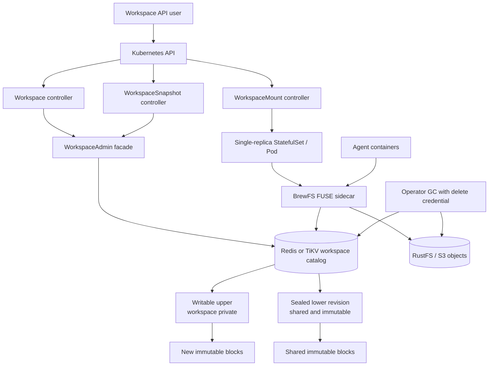
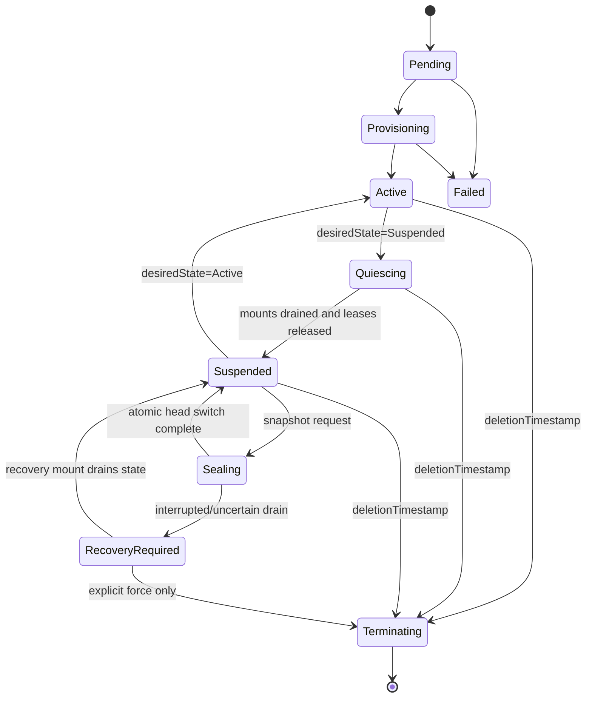
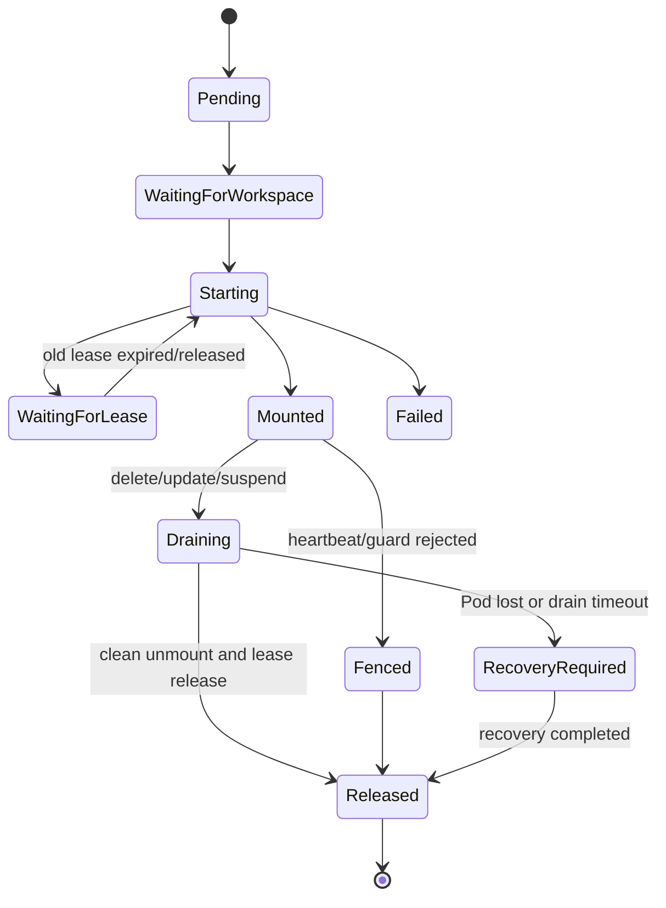

# BrewFS Workspace Operator 生命周期实现规范

- 状态：Draft
- 日期：2026-09-03
- 目标版本：`storage.brewfs.io/v1alpha1`
- 适用后端：Redis、TiKV
- 依赖能力：`workspace-overlay` / `workspace-v1`

## 1. 目的

本规范定义 Kubernetes 场景下 BrewFS workspace 的声明式管理方式，作为后续 CRD、controller、挂载工作负载和测试代码的实现依据。

设计重点是：

1. 把逻辑 workspace、运行时挂载和不可变快照拆成独立生命周期；
2. 保证任意 agent 的写操作只能进入自己的 writable upper layer；
3. 保证一个 workspace 当前引用的 sealed lower revision 不会被挂载进程、其他 workspace 或 GC 原地修改；
4. 正确处理 Pod 重启、节点故障、operator 重启、lease 过期、seal 中断和资源删除；
5. 不改变现有 `BrewFSCluster` / `BrewFSMount` 的 flat-volume 行为；
6. Redis 和 TiKV 使用完全一致的状态机语义。

本文只定义实现方案，不包含与其他系统的对比。

## 2. 范围与非目标

### 2.1 本期范围

- 扩展 `BrewFSCluster`，使其能够初始化并声明一个 `workspace-v1` volume；
- 新增 `BrewFSWorkspace`；
- 新增 `BrewFSWorkspaceMount`；
- 新增 `BrewFSWorkspaceSnapshot`；
- 管理 workspace 的 create、mount、suspend、resume、seal、snapshot 和 delete；
- 管理 mount lease、holder generation、优雅 drain 和异常 fencing；
- 用 finalizer 保护 mount、workspace、snapshot 和 cluster 的删除顺序；
- 为 agent workload 生成单 workspace、单 writable mount 的 Pod/StatefulSet；
- 为 lower metadata、lower object blocks 和 GC root 提供不可变保护；
- 为上述流程提供 status conditions、Events、metrics 和端到端测试。

### 2.2 非目标

- 不在本期实现 CSI controller/node plugin；
- 不允许同一个 workspace 同时存在多个 writable mount；
- 不支持 workspace mount 的 DaemonSet 或 `replicas > 1`；
- 不自动修改用户已有的 Deployment/StatefulSet；
- 不自动执行跨 workspace merge；
- 不在本期把 commit/publish 暴露成 Kubernetes API；
- 不支持 etcd workspace catalog；
- 不改变 flat-volume 的 metadata、mount 或 GC 路径；
- 不防御拥有 Redis/TiKV/S3 管理员权限的基础设施管理员。这里的不可变保证覆盖 Kubernetes tenant、agent workload 和正常 BrewFS runtime；基础设施管理员属于信任边界之外。

## 3. 核心设计决策

### 3.1 保留现有两层 Operator

现有资源继续保持原职责：

- `BrewFSCluster`：管理 Redis、RustFS、配置和 workspace volume bootstrap；
- `BrewFSMount`：只管理现有 flat-volume 挂载。

workspace 不通过给 `BrewFSMount` 增加大量条件分支来实现。新增 controller 和模块必须通过独立 Cargo feature 编译，避免影响原有 operator 路径。

### 3.2 新增三个 workspace 资源

1. `BrewFSWorkspace`
   - 表示一个长期存在的逻辑 COW workspace；
   - 在后端对应一个稳定的 `workspace_id`；
   - 即使挂载 Pod 被删除或重建，workspace 身份和 upper layer 仍然保留。
2. `BrewFSWorkspaceMount`
   - 表示一次可重建的运行时挂载；
   - 负责 FUSE sidecar、agent containers、lease 和本地 writeback 状态；
   - 同一 workspace 最多一个 writable mount。
3. `BrewFSWorkspaceSnapshot`
   - 表示一个由后端 `SnapshotRecord` 固定的精确 `BaseRevision`；
   - 是 lower layer 的声明式、不可变引用和 GC root；
   - Ready 后 spec 和 revision 均不可改变。

### 3.3 lower 不是可写 Kubernetes volume

workspace lower 不会作为一个单独的 hostPath/PVC 暴露给 Pod。agent 只看到一个统一的 FUSE mount：

- upper 命中时读取 upper；
- upper 未命中时读取 sealed lower；
- 所有 mutation 通过 `HeadGuard` 写入 writable upper；
- lower layer ID 从不作为 mutation target。

因此 `readOnly: true` 不是 lower 不可变性的主要机制。不可变性必须由 workspace metadata 状态机、COW object 写入和权限隔离共同保证。

### 3.4 一个 mount 始终只有两层

每次可用挂载必须满足：

```text
writable head (depth=2, owner_workspace_id=<workspace>)
  -> sealed base (depth=1, owner_workspace_id=None)
  -> null
```

seal 是唯一允许切换 base 的操作。seal 创建新的 sealed base 和新的空 writable head，然后以 CAS 原子切换 workspace head；旧 base 永远不原地修改。

## 4. 总体架构



controller 通过一个 backend-neutral `WorkspaceAdmin` facade 操作 workspace catalog，不允许通过 shell 调用 CLI 并解析日志。Redis/TiKV 差异只存在于 `WorkspaceStore` 实现中。

## 5. Cargo 与代码隔离

operator 新增 feature：

```toml
[dependencies]
brewfs = { path = "../..", default-features = false, optional = true }

[features]
default = []
workspace-operator = ["dep:brewfs", "brewfs/workspace-overlay"]
```

建议代码布局：

```text
operator/brewfs-operator/src/
├── crd.rs                         # 现有 flat CRD，保持兼容
├── reconciler.rs                  # 现有 flat controller，保持兼容
└── workspace/
    ├── mod.rs
    ├── crd.rs
    ├── admin.rs                   # WorkspaceAdmin trait/backend factory
    ├── cluster.rs                 # workspace volume bootstrap
    ├── workspace_controller.rs
    ├── mount_controller.rs
    ├── snapshot_controller.rs
    ├── workload.rs                # sidecar/StatefulSet/PVC builder
    ├── finalizer.rs
    ├── status.rs
    └── tests.rs
```

编译约束：

- 未启用 `workspace-operator` 时，不编译上述模块和三个新 controller；
- 现有 `BrewFSCluster` 和 `BrewFSMount` 的序列化结果不得变化；
- 普通 BrewFS binary 的 `workspace-overlay` feature 仍默认关闭；
- workspace runtime 镜像必须显式包含 `workspace-overlay`。

## 6. `BrewFSCluster` 扩展

### 6.1 Spec

```yaml
apiVersion: storage.brewfs.io/v1alpha1
kind: BrewFSCluster
metadata:
  name: demo
spec:
  redis: {}
  rustfs: {}
  workspace:
    enabled: true
    catalogBackend: Redis       # Redis | TiKV
    namespace: brewfs-demo
    leaseTtlSeconds: 30
    heartbeatSeconds: 10
    gcGraceSeconds: 60
    catalogStorageSize: 5Gi   # Operator-managed Redis catalog only
```

新增 `WorkspaceClusterSpec`：

| 字段 | 类型 | 默认值 | 约束 |
|---|---|---:|---|
| `enabled` | bool | false | false 时不创建 workspace catalog |
| `catalogBackend` | enum | Redis | 仅 Redis/TiKV |
| `namespace` | string | `<cluster namespace>-<cluster name>` | 创建后不可变，必须通过 DNS/key-prefix 校验 |
| `leaseTtlSeconds` | u32 | 30 | 10..300 |
| `heartbeatSeconds` | u32 | 10 | 必须小于 TTL/2 |
| `gcGraceSeconds` | u32 | 60 | 必须大于等于 lease TTL |
| `catalogStorageSize` | Quantity string | 5Gi | Redis catalog PVC 容量，不能为空 |

### 6.2 Bootstrap

cluster controller 必须执行幂等 bootstrap：

1. 等待 Redis/TiKV 和 RustFS Ready；
2. 建立 workspace catalog 连接；
3. 检查 `VolumeHeader`；
4. 若不存在，使用由 `BrewFSCluster.metadata.uid` 派生的确定性 UUID 创建：
   - `volume_id`；
   - root workspace ID；
   - root sealed layer ID；
   - root writable layer ID；
5. 若已经存在，严格核对 volume ID、format、schema version 和 cluster UID annotation；
6. 为初始 sealed revision 创建由 cluster UID 派生的确定性 SnapshotRecord，使其成为 cluster root GC root；
7. reserved root workspace 不允许被普通 Mount CR 引用；
8. 将初始 sealed revision 固定为 cluster root revision；
9. 将精确 revision 和 cluster root snapshot ID 写入 status。

不得在重试时创建第二个 volume root。若相同 namespace 已被另一个 cluster 初始化，phase 必须为 `Conflict`，不得接管。

### 6.3 Status

```yaml
status:
  workspace:
    volumeId: "..."
    schemaVersion: 1
    catalogBackend: Redis
    catalogNamespace: brewfs-demo
    rootSnapshotId: "..."
    rootRevision:
      layerId: "..."
      sealedVersion: 1
      rootHash: "..."
  conditions:
    - type: WorkspaceCatalogReady
      status: "True"
```

## 7. `BrewFSWorkspace` CRD

### 7.1 Spec

```yaml
apiVersion: storage.brewfs.io/v1alpha1
kind: BrewFSWorkspace
metadata:
  name: agent-42
spec:
  clusterRef:
    name: demo
  source:
    kind: Snapshot             # ClusterRoot | Snapshot
    name: repo-main            # ClusterRoot 时省略
  desiredState: Active         # Active | Suspended
  ownerId: agent-42
  deletionPolicy: Delete       # Delete | Retain | SnapshotAndDelete
```

字段语义：

| 字段 | 是否可变 | 说明 |
|---|---|---|
| `clusterRef` | 否 | 同 namespace 的 `BrewFSCluster` |
| `source` | 否 | 只能解析为精确 `BaseRevision`，不接受“workspace latest” |
| `desiredState` | 是 | Active 允许 mount；Suspended 要求所有 mount 完成 drain/release |
| `ownerId` | 否 | 写入 backend workspace owner |
| `deletionPolicy` | 删除前可变 | 删除开始后冻结 |

CRD 必须使用 CEL 校验 `clusterRef`、`source` 和 `ownerId` 的不可变性。
Snapshot source 必须与目标 Workspace 引用同一个 `BrewFSCluster`，禁止跨 catalog/volume 引用 revision。

### 7.2 确定性身份

`workspace_id` 不由每次 reconcile 随机生成：

```text
workspace_id = UUIDv5(cluster volume_id, BrewFSWorkspace.metadata.uid)
initial_head_layer_id = UUIDv5(workspace_id, "head/0")
```

后端需要新增幂等 `ensure_workspace` primitive：

- 记录不存在：创建；
- 记录存在且 workspace ID、base revision、owner 和 initial head 完全相同：成功；
- 任一字段不同：`Conflict`，不得覆盖。

status 只是后端状态的缓存，controller 重启后必须能通过确定性 ID 从 backend 恢复，不得依赖旧 status 才能继续。

### 7.3 Status

```yaml
status:
  observedGeneration: 3
  phase: Active
  workspaceId: "..."
  originRevision:
    layerId: "..."
    sealedVersion: 7
    rootHash: "..."
  currentBaseRevision:
    layerId: "..."
    sealedVersion: 8
    rootHash: "..."
  headLayerId: "..."
  headEpoch: 4
  activeMountRef: agent-42-mount
  lastCleanReleaseEpoch: 4
  conditions: []
```

`originRevision` 在资源整个生命周期内不变；`currentBaseRevision` 只会在显式 seal 成功后改变。

### 7.4 Phase



`phase` 是粗粒度展示；自动化判断必须使用 `conditions` 和 backend state。

### 7.5 Conditions

至少实现：

- `Ready`
- `SourceResolved`
- `BaseVerified`
- `MountActive`
- `Quiesced`
- `RecoveryRequired`
- `DeletionBlocked`
- `Degraded`

每个 condition 必须包含 `status`、`reason`、`message`、`observedGeneration` 和 `lastTransitionTime`。语义未变化时不得刷新 `lastTransitionTime`。

## 8. `BrewFSWorkspaceMount` CRD

### 8.1 Spec

```yaml
apiVersion: storage.brewfs.io/v1alpha1
kind: BrewFSWorkspaceMount
metadata:
  name: agent-42-mount
spec:
  clusterRef:
    name: demo
  workspaceRef:
    name: agent-42
  mountPath: /workspace
  image: ghcr.io/brewfs/brewfs:latest
  cache:
    mode: WriteBack             # WriteThrough | WriteBack
    storageClassName: standard
    size: 20Gi
    reclaimPolicy: Delete       # Delete | Retain
  agent:
    containers:
      - name: agent
        image: example/agent:latest
        workspaceMountPath: /workspace
  terminationGracePeriodSeconds: 90
```

约束：

- 一个 Mount CR 只允许一个 Pod replica；
- workload 固定使用单副本 StatefulSet；
- StatefulSet 使用 `podManagementPolicy=OrderedReady` 和 `updateStrategy=OnDelete`；
- 不支持 DaemonSet；
- `clusterRef` 和 `workspaceRef` 创建后不可变；
- source workspace 的 clusterRef 必须与 Snapshot clusterRef 相同；
- `mountPath` 必须为绝对路径，且不能覆盖 `/`, `/proc`, `/sys`, `/dev`, `/var/run/secrets`；
- WriteBack 必须有持久 PVC；
- `terminationGracePeriodSeconds >= leaseTtlSeconds + drainTimeoutSeconds`；
- 同一 workspace 如果已有非终止中的 Mount CR，第二个 Mount CR保持 `WaitingForLease`，不创建 writable Pod；
- backend lease 是最终互斥和 fencing 依据，Kubernetes 列表检查只用于快速失败。

### 8.2 Pod 模型

workspace mount 默认采用同 Pod sidecar 模型，不使用节点级 hostPath：

1. operator 生成一个 native sidecar init container `brewfs-mount`，`restartPolicy: Always`；
2. sidecar 持有 `/dev/fuse`、`SYS_ADMIN` 和 runtime Secret；
3. sidecar 将 BrewFS 挂载到共享 `emptyDir`/mount volume；
4. 后续 init container `wait-for-brewfs` 等待 mount readiness marker；
5. agent containers 只看到统一后的 workspace mount；
6. agent containers 不挂载 backend Secret，不拥有 `SYS_ADMIN`，不与 sidecar共享 PID namespace；
7. sidecar 和 agent 使用 mount propagation 共享 FUSE mount；
8. 更新 workload 时先将 StatefulSet 缩为 0，等待 clean release，再更新 Pod template 并恢复为 1；
9. controller 禁止两个 Pod 并行滚动更新。

此模式要求 Kubernetes 1.29+ native sidecar。若集群不支持，controller 设置 `UnsupportedKubernetesVersion`，不得退化为不安全的并行启动。

现有 `BrewFSMount.hostMountPath` 模式不用于 workspace v1。节点级 workspace mount 留给后续 CSI/NodeRuntime 设计。

### 8.3 Runtime 参数

生成的 sidecar 必须显式传入：

- `volume_format=workspace-v1`；
- `--workspace <status.workspaceId>`；
- `--workspace-namespace <cluster workspace namespace>`；
- Redis 或 TiKV backend 参数；
- 独立 cache root；
- lease TTL/heartbeat；
- Pod UID 和 mount CR UID，写入 lease holder identity；
- 仅 runtime 权限的 backend/object credentials；
- `--workspace-operator-managed`；该统一开关同时禁止 mount-local GC 和 mount 启动时的全局 seal recovery。

不得允许 agent 自己提供或覆盖上述参数。

当前 `mount_workspace_with_catalog` 会启动本地 `WorkspaceGc`，并在获取 lease 前调用 `recover_incomplete_seals()`。Operator 模式必须把这两个职责移到 workspace controller：

- mount sidecar 不持有 object delete/topology credential；
- GC 由一个有 leader election 的 operator worker 集中执行；
- seal recovery 由对应 Workspace/Snapshot reconcile 驱动；
- 普通 CLI mount 的现有默认行为保持不变。

### 8.3.1 实现映射

- `src/config.rs` 定义 opt-in 的 `workspace_operator_managed`，默认值为 `false`；
- `src/main.rs` 在该模式跳过 mount-local recovery/GC，并同时监听 SIGINT 与 SIGTERM，确保 Kubernetes 终止 Pod 时走 unmount/release；
- `src/cadapter/*` 和 `src/chunk/store.rs` 为所有 workspace volume 强制原子 create-only object put，flat volume 保持原路径；
- `operator/brewfs-operator/src/workspace/workload.rs` 生成 native sidecar StatefulSet、独立 cache、认证 Redis catalog 和仅挂到 sidecar 的 Secret；
- `operator/brewfs-operator/src/workspace/admin.rs` 将 Redis/TiKV 统一到 `WorkspaceAdmin`；
- `operator/brewfs-operator/src/workspace/controller.rs` 实现 cluster guard、workspace、mount、snapshot 及 finalizer 状态机。

### 8.4 持久化 MountSession 记录

不修改现有 `SnapshotLease` 的 v1 编码。新增独立的 `WorkspaceMountRecord`：

```rust
struct WorkspaceMountRecord {
    mount_id: Uuid,              // derived from Mount CR UID
    workspace_id: WorkspaceId,
    pod_uid: String,
    lease_id: LeaseId,
    holder_generation: u64,
    head_layer_id: LayerId,
    head_epoch: u64,
    state: MountRuntimeState,    // Starting, Active, Draining, CleanReleased,
                                 // Expired, Fenced, RecoveryRequired
    pending_writeback_bytes: u64,
    drained_head_epoch: Option<u64>,
    updated_at_ns: i64,
}
```

需要新增原子 store primitives：

- `ensure_mount_session(mount_id, pod_uid, workspace)`：对同一 Pod 重试返回相同 generation；
- `mark_mount_draining(...)`；
- `release_mount_session(...)`：在同一 transaction 中写 `CleanReleased`、`drained_head_epoch` 并把 lease 置为 Released；
- `mark_mount_fenced(...)`；
- `load_mount_session(mount_id)`。

operator 从该记录判断 durable drain，不从 Pod phase 或日志推断。新增 side record 不改变 `workspace-v1` 已有 record 编码；Redis/TiKV 需使用独立 versioned key/table，并提供向前兼容初始化。

### 8.5 Status

```yaml
status:
  phase: Mounted
  podName: agent-42-mount-0
  podUid: "..."
  workspaceId: "..."
  leaseId: "..."
  holderGeneration: 123
  mountedHeadLayerId: "..."
  mountedHeadEpoch: 4
  mountedBaseRevision:
    layerId: "..."
    sealedVersion: 8
    rootHash: "..."
  conditions:
    - type: LeaseAcquired
      status: "True"
    - type: Ready
      status: "True"
```

### 8.6 Mount phase



## 9. `BrewFSWorkspaceSnapshot` CRD

### 9.1 Spec

```yaml
apiVersion: storage.brewfs.io/v1alpha1
kind: BrewFSWorkspaceSnapshot
metadata:
  name: agent-42-result
spec:
  workspaceRef:
    name: agent-42
```

约束：

- `workspaceRef` 创建后不可变；
- source workspace 必须处于 `Suspended`；
- source 不得有 active writable lease；
- source 最近一次 mount 必须 clean release，并且 drained head epoch 必须等于当前 head epoch；
- Snapshot CR Ready 后，spec 和 status.revision 不可改变；
- snapshot ID 由 Snapshot CR UID 确定性派生；
- SnapshotRecord 必须在 backend 中作为 GC root 存在。

### 9.2 Snapshot 流程

1. 解析 source workspace 和 cluster；
2. 确认 `desiredState=Suspended`；
3. 确认不存在 active lease；
4. 核对最近 lease 是 `Released`，不是 `Expired`；
5. 在 Snapshot status 中先持久化 `phase=Sealing`、source workspace ID 和待 seal 的 head epoch `E`；该 intent 写入成功前不得开始 seal；
6. controller 使用 operator holder identity 获取一次短期控制 lease；
7. 使用真实 durable remote barrier 执行 seal；
8. seal 将 upper materialize 为新的 flat sealed base，并创建新的空 upper；
9. 原子切换 workspace head，并在完成固定两层压平后令 head epoch 变为 `E+2`；
10. 用确定性 snapshot ID 创建 SnapshotRecord；
11. 校验 `(layer_id, sealed_version, root_hash)`；
12. 更新 Snapshot status 为 Ready；
13. 释放控制 lease，workspace 保持 Suspended。

若在 seal 中崩溃，controller 先调用现有 journal recovery，再将 backend 状态与已持久化 intent 对照：当前 epoch 为 `E` 时重新执行 seal，为 `E+2` 时直接按当前 exact base revision 幂等补建 SnapshotRecord；其他 epoch 表示并发修改或不一致，必须停止并报告冲突。SnapshotRecord 已存在时必须先验证其 exact revision，再直接收敛为 Ready。不得只根据 Kubernetes phase 猜测 seal 是否成功。

### 9.3 Status

```yaml
status:
  phase: Ready
  snapshotId: "..."
  sourceWorkspaceId: "..."
  sourceHeadEpoch: 4
  revision:
    layerId: "..."
    sealedVersion: 9
    rootHash: "..."
  conditions:
    - type: RevisionVerified
      status: "True"
```

## 10. lower 不可变保证

### 10.1 精确 revision

lower 身份必须是完整三元组：

```text
(layer_id, sealed_version, root_hash)
```

禁止只保存 layer ID，禁止在 mount 时解析“某 workspace 当前最新版本”。Workspace 创建后 `originRevision` 不可更改；当前 lower 只有在显式 seal 的原子 head switch 中才能变为一个新 revision。

### 10.2 Metadata 写保护

每个 mutation 在同一 Redis Lua CAS/TiKV transaction 中检查：

- workspace state 为 Active；
- `head_layer_id` 和 `head_epoch` 与 mount view 一致；
- lease ID、holder generation、expiry 一致；
- target layer 等于当前 head；
- target layer state 为 Writable；
- `owner_workspace_id == workspace_id`。

sealed lower 必须满足：

- `state == Sealed`；
- `owner_workspace_id == None`；
- `parent_layer_id == None`；
- `depth == 1`；
- `sealed_version` 和 `root_hash` 存在并与引用完全相同。

任何失败都必须 fail closed，不得回退到 flat metadata path，不得把 mutation 重定向到 lower。

### 10.3 Object 写保护

workspace 模式必须保持 committed blocks write-once：

1. 每次 upper 数据写入先通过 backend 原子 allocator 获得新的 slice ID；
2. 不复用 lower 引用的 slice ID；
3. workspace runtime 使用 create-only object put；
4. S3/RustFS 使用条件创建语义，目标 key 已存在时返回冲突；
5. local filesystem backend 使用 `create_new` 等价语义；
6. 不支持 create-only 的 object backend 不允许标记 WorkspaceCatalogReady；
7. runtime credential 不包含 DeleteObject；
8. object 删除只由 operator GC 使用独立 credential 执行；
9. runtime 写失败时只持久化 orphan slice，不直接删除已创建 object；
10. multipart upload 可以 AbortMultipartUpload，但不能覆盖或删除 committed object。

需要在 block-store 层拆分接口：

```rust
trait WorkspaceRuntimeBlockStore {
    async fn get(&self, key: BlockKey) -> Result<Bytes>;
    async fn put_new(&self, key: BlockKey, value: Bytes) -> Result<()>;
}

trait WorkspaceGcBlockStore: WorkspaceRuntimeBlockStore {
    async fn delete(&self, key: BlockKey) -> Result<()>;
}
```

FUSE runtime 不得持有 `WorkspaceGcBlockStore`。

### 10.4 Lower 验证

以下时刻必须执行 O(1) revision verification：

- Workspace 创建前；
- Mount Pod 创建前；
- mount process 获取 lease 前；
- seal head switch 前后；
- Snapshot 标记 Ready 前；
- operator 从 crash 恢复后第一次 reconcile。

O(1) verification 核对 layer record 和 revision tuple，不扫描全量 metadata。完整 digest/content audit 是显式维护操作，不进入正常 reconcile 热路径。

### 10.5 GC 保护

以下对象均为 GC root：

- active workspace head 及其 sealed base；
- `BrewFSWorkspaceSnapshot` 对应 SnapshotRecord；
- active/releasing lease；
- incomplete seal journal；
- recovery grace 内的 expired lease。

GC 必须先生成 reachability snapshot，再删除 object blocks，最后删除 layer metadata。任一阶段失败都保留可重试记录。只要一个 workspace 或 snapshot 仍引用 lower revision，lower layer 和其 blocks 都不可删除。

### 10.6 凭据边界

- operator admin Secret：允许 topology、snapshot、discard 和 GC，只挂载到 operator；
- mount runtime Secret：允许 runtime read/CAS/new-object put，不允许 snapshot、discard、GC 或 object delete；
- agent container：不挂载任何 backend/object Secret；
- `shareProcessNamespace` 必须为 false；
- agent container 默认 `allowPrivilegeEscalation=false`，删除全部 capabilities；
- 只有可信的 BrewFS sidecar 进入 lower 保护的 TCB。

即使 agent 对 FUSE mount 拥有完整 POSIX 写权限，写入仍只能形成 upper delta 和新 object block。

## 11. 生命周期流程

### 11.1 创建 Workspace

1. 添加 finalizer `storage.brewfs.io/workspace-protection`；
2. 等待 cluster `WorkspaceCatalogReady=True`；
3. 将 source 解析为精确 revision；
4. 验证 source sealed layer；
5. 调用幂等 `ensure_workspace`；
6. backend 创建一个空 writable head 指向 source；
7. 再次 inspect 固定两层结构；
8. 写 status/conditions，phase=Active 或 Suspended。

### 11.2 启动 Mount

1. Mount controller 添加 `workspace-mount-protection` finalizer；
2. 验证 workspace Active、Ready、BaseVerified；
3. 确认不存在另一个 Mount CR；
4. 创建 runtime Secret、ConfigMap、PVC 和单副本 StatefulSet；
5. mount sidecar验证 volume header、两层结构和 exact base；
6. backend 通过 `ensure_mount_session` 分配或恢复 holder generation；
7. 原子获取 writable lease，并写入 MountSession 的 head epoch 和 Pod UID；
8. FUSE ready 后写 readiness marker；
9. agent init gate 通过，agent containers 启动；
10. controller 从 backend inspect lease，不只根据 Pod Ready 更新 status。

### 11.3 正常重启或镜像更新

1. StatefulSet 停止旧 Pod，不并行创建新 writable Pod；
2. sidecar 停止接收新 FUSE mutation；
3. flush/fsync/writeback drain 到 remote object store；
4. unmount FUSE；
5. 原子持久化 MountSession clean release、drained head epoch 并 release lease；
7. 新 Pod 获取新的 holder generation 和 lease；
8. 旧进程即使迟到，其 guard 也因 generation/lease 不匹配而被 fencing。

### 11.4 Suspend

当 `BrewFSWorkspace.spec.desiredState=Suspended`：

1. Workspace condition 变为 `Quiesced=False/Requested`；
2. Mount controller 将工作负载缩为 0/删除 Pod；
3. 等待 clean drain 和 lease Released；
4. 如果 mount 正常退出，workspace phase=Suspended；
5. 如果 lease 过期而不是 Released，phase=RecoveryRequired；
6. 所有 Mount CR保持存在，但不得重建 Pod，直到 desiredState 重新为 Active。

### 11.5 Resume

1. `desiredState=Active`；
2. 验证 current base revision；
3. 确认没有 incomplete seal journal；
4. 若有 recoverable journal，先完成/回滚 recovery；
5. Mount controller 重新创建 Pod；
6. 新 Pod 获取新 generation/lease 并 mount 当前 head epoch。

### 11.6 Pod crash / lease expired

1. heartbeat 停止后，backend authoritative time 使 lease 过期；
2. 所有来自旧 generation 的后续 mutation 被拒绝；
3. controller 不把 `Expired` 当成 clean release；
4. 如果 WriteBack PVC 可用，启动 recovery Pod，使用同一 PVC 恢复 pending upload；
5. recovery Pod完成 drain、写 clean release 并退出；
6. 如果 PVC丢失，设置 `RecoveryRequired=True`，禁止 seal 和 SnapshotAndDelete；
7. 只有显式 force-delete annotation 才能放弃未确认 upper writeback。

force annotation：

```text
storage.brewfs.io/force-delete: "true"
storage.brewfs.io/force-delete-reason: "<non-empty audit reason>"
```

force 只允许丢弃/围栏 upper；它绝不能修改当前或历史 lower。

### 11.7 Operator crash

恢复后每个 controller 必须：

1. 从 backend 重建真实 workspace/snapshot/lease/journal 状态；
2. 从 Kubernetes owner UID重新计算确定性 ID；
3. 完成或回滚 incomplete seal；
4. 对已完成的 ensure/create 识别为成功；
5. 不重复创建 workspace、snapshot 或 root layer；
6. 不依据过期 status 发起 destructive operation。

## 12. 删除与 finalizer

### 12.1 Mount 删除

finalizer：`storage.brewfs.io/workspace-mount-protection`

顺序：

1. 停止 agent；
2. drain writeback；
3. unmount；
4. release lease；
5. 等待 backend 确认 Released；
6. 按 cache reclaim policy 删除或保留 PVC；
7. 删除 Secret/ConfigMap；
8. 移除 finalizer。

backend 不可达或 lease 状态不确定时不得移除 finalizer。

### 12.2 Workspace 删除

finalizer：`storage.brewfs.io/workspace-protection`

通用前置顺序：

1. backend CAS 将 workspace 标记为 Deleting，禁止新 lease；
2. 删除所有关联 Mount CR；
3. 等待 Mount finalizer 完成；
4. 确认无 active/releasing lease；
5. 根据 deletionPolicy 继续。

策略：

- `Delete`
  - `mark_workspace_deleting(force=false)`；
  - backend 记录进入 GC；
  - finalizer 在 deletion marker 持久化后移除，不等待所有 blocks 实际删除。
- `Retain`
  - 保留 backend workspace record；
  - 记录 Kubernetes Event 和 retained workspace ID；
  - 移除 finalizer；
  - 后续只能通过显式 adopt 流程重新接管。
- `SnapshotAndDelete`
  - 要求 clean release；
  - 创建一个无 ownerReference 的确定性 `BrewFSWorkspaceSnapshot`；
  - 等待 Snapshot Ready；
  - 再标记 workspace deleting；
  - snapshot 继续固定最终 revision。

删除已经开始后，不允许从 Delete 改为 Retain，避免 reconcile 结果不确定。

### 12.3 Snapshot 删除

finalizer：`storage.brewfs.io/workspace-snapshot-protection`

1. 同时从 Kubernetes API 和 backend 查找仍引用该 Snapshot CR 或 exact revision 的 Workspace，不依赖可能缺失的 status；
2. 若存在引用，设置 `DeletionBlocked=True` 并保留 finalizer；
3. 若无引用，删除 backend SnapshotRecord；
4. 确认 snapshot GC root 已删除；
5. 移除 finalizer；
6. 具体 lower 回收由 lease-aware GC 决定。

### 12.4 Cluster 删除

为启用 workspace 的 `BrewFSCluster` 添加 `storage.brewfs.io/workspace-cluster-protection`：

- 存在 Workspace、WorkspaceMount 或 Snapshot 引用时，禁止删除 Redis/TiKV/RustFS；
- status/Event列出阻塞数量；
- 不允许 ownerReference 静默级联删除所有 workspace；
- 只有所有子资源完成各自 finalizer 后才释放 cluster 后端。

## 13. 并发与幂等

### 13.1 Source of truth

- Kubernetes spec：用户期望状态；
- workspace backend：head、epoch、lease、seal、snapshot、GC 的事实来源；
- Kubernetes status：可重建缓存；
- Pod status：只表示容器状态，不代表 lease 或 durable drain 状态。

### 13.2 竞争处理

- 两个 Mount controller 竞争同一 workspace：backend writable lease 只允许一个成功；
- Mount 与 Suspend 竞争：workspace state/lease CAS决定结果；
- Snapshot 与 Mount 竞争：Snapshot 只接受 Suspended + no active lease；
- Snapshot 与 Delete 竞争：Deleting state 拒绝新的 seal/snapshot；
- 两个 Snapshot 请求：通过 workspace state和控制 lease 串行化；
- GC 与 mount/seal 竞争：reachability roots、lease grace 和 journal root 阻止提前回收；
- 旧 Pod 与新 Pod 竞争：holder generation + head epoch fencing。

所有 backend transition 必须是原子 CAS/transaction。Kubernetes controller 的单对象队列不能替代 backend fencing。

## 14. WorkspaceAdmin 接口

operator 只依赖窄接口，不直接散落调用 store primitive：

```rust
#[async_trait]
trait WorkspaceAdmin: Send + Sync {
    async fn ensure_volume(&self, request: EnsureVolume) -> Result<VolumeView>;
    async fn ensure_workspace(&self, request: EnsureWorkspace) -> Result<WorkspaceView>;
    async fn inspect_workspace(&self, id: WorkspaceId) -> Result<WorkspaceView>;
    async fn verify_revision(&self, revision: &BaseRevision) -> Result<()>;
    async fn list_leases(&self, id: WorkspaceId) -> Result<Vec<LeaseView>>;
    async fn recover_workspace(&self, id: WorkspaceId) -> Result<RecoveryResult>;
    async fn seal_and_snapshot(&self, request: SealSnapshot) -> Result<SnapshotView>;
    async fn ensure_snapshot(&self, request: EnsureSnapshot) -> Result<SnapshotView>;
    async fn delete_snapshot(&self, id: SnapshotId) -> Result<()>;
    async fn mark_deleting(&self, id: WorkspaceId, force: bool) -> Result<()>;
}
```

backend factory 从 `BrewFSCluster` 生成的 ConfigMap/Secret 创建 Redis 或 TiKV implementation。连接信息变化时 cache 必须失效；Secret 内容不得写入 status、Events 或日志。

## 15. Reconcile 规则

每个 controller 遵循同一骨架：

1. 读取 object 和 namespace；
2. 若有 deletionTimestamp，进入 finalizer path；
3. 确保 finalizer；
4. 校验 spec 和 referenced resources；
5. 从 backend 读取事实状态；
6. 计算纯 `DesiredAction`；
7. 执行至多一个有副作用的状态转换；
8. 重新读取 backend/Kubernetes状态；
9. patch status（只在语义变化时）；
10. 根据结果 requeue。

重试策略：

- dependency not ready：10s；
- active lease waiting：`min(lease_expiry-now, 10s)`；
- backend transient error：指数退避 1s..60s + jitter；
- spec conflict/corrupt metadata/unsupported capability：不做快速循环，写 condition/Event，等待资源变化；
- seal recovery：立即继续直到达到稳定 journal phase，但每次 reconcile 只推进一个 durable phase。

## 16. 可观察性

### 16.1 Events

至少产生：

- `WorkspaceProvisioned`
- `WorkspaceSuspended`
- `WorkspaceResumed`
- `MountLeaseAcquired`
- `MountLeaseReleased`
- `MountFenced`
- `RecoveryRequired`
- `SealStarted`
- `SealRecovered`
- `SnapshotReady`
- `DeletionBlocked`
- `ForceDeleteRequested`

Event 不能包含 Secret 或完整 backend URL。

### 16.2 Metrics

```text
brewfs_operator_workspace_reconcile_total{controller,result}
brewfs_operator_workspace_phase{phase}
brewfs_operator_workspace_mount_ready
brewfs_operator_workspace_lease_wait_seconds
brewfs_operator_workspace_drain_seconds
brewfs_operator_workspace_recovery_total{result}
brewfs_operator_workspace_seal_seconds{result}
brewfs_operator_workspace_finalizer_blocked_seconds{resource,reason}
brewfs_operator_workspace_lower_verification_total{result}
brewfs_operator_workspace_force_delete_total
```

### 16.3 日志字段

统一包含：

- Kubernetes namespace/name/UID；
- workspace ID；
- mount/snapshot ID；
- head layer ID/head epoch；
- lease ID/holder generation；
- seal journal ID/phase；
- reconcile action/result。

## 17. 测试规范

### 17.1 CRD 与纯状态机单元测试

- source/clusterRef/workspaceRef immutability；
- tagged source union 校验；
- lease/heartbeat/drain timeout 范围；
- condition transition time语义；
- phase transition 合法性；
- deterministic ID稳定性；
- deletion policy冻结；
- workspace mount拒绝 DaemonSet/replicas > 1；
- WriteBack 无 PVC配置时拒绝。

### 17.2 Reconciler 测试

使用 fake Kubernetes client + fake `WorkspaceAdmin`：

- create 重试不重复创建 workspace；
- status 丢失后从 backend 恢复；
- 第二个 mount 等待 lease；
- suspend 等待 clean release；
- expired lease 进入 RecoveryRequired；
- backend 不可达时 finalizer 不释放；
- Snapshot 只在 Suspended 时执行；
- seal 每一 journal phase crash 后恢复；
- Delete/Retain/SnapshotAndDelete 三种路径；
- Snapshot 有引用时删除被阻塞；
- Cluster 有子资源时删除被阻塞。

### 17.3 Lower 不可变测试

对 Redis 和 TiKV 各执行：

1. 创建一个 sealed base snapshot；
2. 从它 fork 两个 workspace；
3. 同时对两个 workspace 执行 create/write/truncate/rename/unlink/xattr/chmod/chown；
4. 验证所有 mutation 只产生在各自 upper；
5. 验证 base layer record、delta rows 和 revision tuple 完全不变；
6. 验证 sibling mutation 互不可见；
7. 尝试用 stale lease/head epoch 写入并确认原子拒绝；
8. 尝试把 sealed layer 作为 mutation target 并确认拒绝；
9. 制造 object key collision，确认 create-only put 不覆盖旧 block；
10. 用 runtime credential尝试 DeleteObject，确认权限拒绝；
11. 在 active workspace/snapshot 存在时运行 GC，确认 lower 未删除；
12. 删除所有 root 并经过 grace 后，确认 GC 才能回收。

### 17.4 Kubernetes 集成测试

测试环境至少覆盖 Kind 或真实 Kubernetes 1.30：

- Redis + RustFS；
- TiKV + RustFS；
- workspace create/mount/read/write；
- 同 base 两个 agent 隔离；
- sidecar ready gate；
- agent container 看不到 Secret；
- Pod 正常重启 lease handoff；
- `kill -9` 后 lease expiry/fencing/recovery；
- operator 在 Provisioning、Sealing、Terminating 中重启；
- drain 期间删除 CR；
- Snapshot 后 fork 新 workspace；
- cluster 删除保护；
- PVC retain/delete策略。

### 17.5 文件系统回归

- 单 workspace pjdfstest；
- 单 workspace xfstests，沿用 workspace exclude 文件；
- 单 workspace LTP，沿用 workspace skip 文件；
- 双 workspace 并发 isolation suite；
- seal 前后相同 mounted view 的数据一致性；
- flat `BrewFSMount` 原有 operator 测试全部通过。

### 17.6 故障注入

在以下 durable 边界前后终止 operator 或 mount Pod：

- backend workspace create 前/后；
- lease acquire 前/后；
- writeback drain 前/后；
- lease release 前/后；
- seal Prepare/Quiesced/DataDrained/Hashed/HeadSwitched；
- SnapshotRecord create 前/后；
- workspace deleting marker 前/后；
- object delete 与 layer metadata delete 之间。

每个测试都必须证明重试后只有一个逻辑结果，且旧 lower 没有被修改或提前回收。

## 18. 实现顺序

### PR 1：CRD 和 controller scaffolding

- feature gate；
- 三个 CRD及 status/conditions；
- CRD generation、RBAC、manifests；
- controller wiring；
- validation/unit tests；
- 不创建真实 workspace。

### PR 2：WorkspaceAdmin 和 cluster bootstrap

- backend factory；
- deterministic IDs；
- `ensure_volume` / `ensure_workspace`；
- Redis/TiKV实现；
- cluster workspace status；
- idempotency/crash tests。

### PR 3：Lower/object/GC 权限基础

- runtime/admin credential 拆分；
- create-only object put；
- runtime 接口移除 delete；
- 写失败只记录 orphan slice；
- mount-local GC/recovery 禁用参数；
- lower backend contract tests。

### PR 4：Workspace controller

- source resolution；
- exact revision verification；
- create/adopt/status；
- Active/Suspended状态；
- workspace finalizer基础路径。

### PR 5：WorkspaceMount controller

- single-replica native-sidecar workload；
- Secret/ConfigMap/PVC；
- MountSession record 和 lease holder identity；
- readiness gate；
- graceful drain/release；
- mount finalizer和 restart tests。

### PR 6：Snapshot/seal/recovery/finalizer

- Snapshot CR controller；
- clean release/drained epoch记录；
- durable remote barrier；
- seal journal recovery；
- recovery Pod；
- SnapshotAndDelete；
- Snapshot/Cluster删除保护；
- leader-elected operator GC；
- lower immutability suites。

### PR 7：Kubernetes E2E 和文档

- Redis/TiKV完整矩阵；
- pjdfstest/xfstests/LTP；
- kill/restart/finalizer故障注入；
- examples、runbook、upgrade notes。

## 19. Definition of Done

满足以下全部条件才视为实现完成：

1. 现有 flat operator资源和行为保持兼容；
2. Workspace、Mount、Snapshot 拥有独立且可恢复的生命周期；
3. 同一 workspace 不可能存在两个成功的 writable lease；
4. Pod/节点/operator崩溃后旧 writer 被 backend fencing；
5. Suspend 只有在 durable drain + clean release 后才成功；
6. Snapshot 只指向完整 exact revision；
7. mount 前验证固定的 writable+sealed 两层结构；
8. 任何 agent mutation都只写 upper；
9. sealed lower metadata没有 mutation API路径；
10. lower object block使用 create-only语义，runtime没有 delete权限；
11. workspace、snapshot、lease和journal均正确保护 GC reachability；
12. finalizer在 backend不确定时 fail closed；
13. reconcile 重试不会重复创建 volume/workspace/snapshot；
14. Redis、TiKV实现通过同一 backend contract；
15. 两个 sibling workspace共享 lower且 mutation互不可见；
16. Redis/TiKV Kubernetes E2E、workspace pjdfstest、xfstests、LTP和现有 operator回归全部通过；
17. 所有 force delete都有 annotation、reason、Event和metric审计记录。

## 20. 必须保持的最终不变量

在任意可观察时刻，系统必须同时满足：

```text
mount view = exactly one writable upper + exactly one sealed lower
writes(mount) -> writable upper only
sealed lower identity = exact(layer_id, sealed_version, root_hash)
sealed lower metadata is never updated in place
committed lower blocks are never overwritten
old holder generation cannot commit a mutation
referenced lower cannot be garbage-collected
uncertain lifecycle state fails closed
```

这些不变量优先于自动恢复速度和删除速度。
