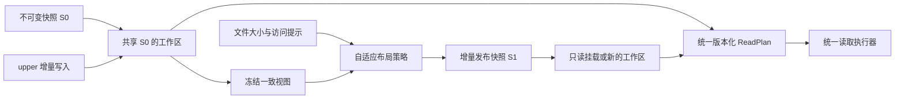

# BrewFS v3：增量工作区与自适应只读快照的统一设计

Status: **implementation in progress**
Owner: BrewFS workspace / packed read path
Scope: mutable workspaces, immutable snapshots, and adaptive physical layout on S3/OSS

当前代码已经落地 wire/container、GM05 GroupMeta、动态 frame packer、分页 index、
bounded remote frame descriptor 读取、group catalog lookup 和统一 `UnifiedReadPlan`
生成。PM05 manifest 已固化 root identity，II05 inode index 和 GM05 GroupMeta 已包含
parent/POSIX 热属性；只读 FUSE mount 仍需接入实际 dispatch 和 generation-aware VFS
resolver。未接入前不把 packed-v3 的局部 probe 数字写入性能对比表。

本文是 v3 的设计提案。它不修改已经发布的 `packed-metadata-v1` 或
`packed-metadata-v2` 对象；v1/v2 继续按各自的 magic 和校验规则读取。v3 必须使用
新的 manifest/object magic，旧 reader 遇到 v3 应明确返回 `UnsupportedFormat`，不能把
v3 当成 v2 或退回 Redis/TiKV。

## 0. 统一主张和三项贡献

**同一份数据在可修改阶段只记录增量，在冻结发布时形成按访问粒度布局的不可变快照；
所有阶段通过同一套带版本的逻辑区间和读取计划访问。** 这是 v3 的整体设计主张。

| 用户定义的创新点 | 在数据生命周期中的责任 | 与另外两项的连接 |
| --- | --- | --- |
| **1. overlay-workspace** | 对共享快照 fork 出隔离工作区，只保存新增/覆盖/删除 | upper 与 lower 都解析为逻辑区间；冻结后的有效视图成为下一份 packed snapshot |
| **2. readonly-packed** | 将目录窗口、热属性和物理定位保存为有界可读的快照 | 同时是训练/推理的只读数据源和 workspace 的 lower；读取不依赖 lower KV 记录 |
| **3. dynamic block** | 在导入/冻结/重布局时选择独立解码单元的大小 | 将同一逻辑区间映射到变长 frame；read plan 隔离 upper block 和 lower frame 的差异 |



这三项能力的合成边界可以写成一个不变量：

```text
effective_view(g) = apply(upper_delta[g], lower_snapshot[g.lower_digest])
published_snapshot = pack(seal(effective_view(g)), layout_profile)
read(request) = execute(resolve(request, pinned_generation(g)))
```

其中 `upper_delta` 只负责“哪些逻辑区间被新增、覆盖或打洞”，`lower_snapshot` 只负责
“未被覆盖的完整有效视图如何分页和放置”，`layout_profile` 只负责冻结时把有效区间
放进哪一种 immutable frame。三者共享 `ReadGeneration`、逻辑区间和 `ReadSource`，
因此不会出现 overlay 自己一套定位、packed 自己一套定位、dynamic block 再绕开两者
的第四条读路径。只读挂载把 `upper_delta` 设为空；可写工作区把同一份 lower 放到
resolver 的 fallback 分支；seal/compact 则把 resolver 能看到的有效视图交给 builder。

实现上要坚持四个边界：

* dynamic block 不能改变 POSIX 文件偏移、VFS chunk 或 upper dirty block 的语义；它只
  选择 `PackedFrame` 的物理范围；
* lower 永远不可变，upper 的 mutation 不直接改写 GroupContainer；
* 一个 read 只绑定一个 `(workspace_head_epoch, lower_snapshot_digest)`，计划失效时整
  体重试，不能拼接两个 generation；
* 只读 lower 不启动 Redis/TiKV。可写 workspace 是否使用 KV 是控制面选择，不应渗入
  packed data read path。

S1 复用 S0 未修改的对象和索引页；小范围修改不复制整个 lower 文件或 container。
独立只读挂载就是这个架构中 `upper=None` 的实例，共享下层执行器，完全跳过 upper
探测和 KV 连接。可写 workspace 的控制面仍可使用 Redis/TiKV，不能把“只读 lower
不依赖 KV”宣传成整个可写系统没有 KV。

统一的对象是 **文件身份、逻辑区间、版本和发布协议**。upper 的写入缓冲、lower 的
解码 frame、S3 对象、一次 GET 的范围分别优化；无需把它们强制设成同一个大小。
overlay、packing、可变块本身均已有先例，本文凝练的是三者的工程组合及可验证收益，
不在缺少相关工作比较时宣称各单项算法是首次提出。

## 1. 结论先行

v2 的主要限制不是 namespace、extent 或 DataPack 没有分页，而是分页后的读路径仍然
按“一个 inode、一个 slice、一个 frame”串起多个远程定位动作：

```text
v2 directory page
  -> per-entry namespace lookup
  -> per-file extent index lookup
  -> extent batch
  -> slice page
  -> frame page
  -> object page
  -> DataPack header (first use of an object)
  -> one frame Range GET
```

一个 100 KiB 文件因此不能从一个已经得到的目录记录直接读出数据。当前实现还没有
decoded frame cache；相邻文件即使共享同一个 1 MiB frame，也会重复发起 frame Range
GET。当前 v2 fixture 的 `DataPack` frame 目标约为 1 MiB，而 `RemoteDataPack::read_frame`
每次调用都会分配一个新的 frame buffer 并读取整个 frame。

v3 的核心改变是把 **目录可见的热元数据、文件数据放置和可读计划** 放进同一个有界
的 `ReadGroup`，再把多个逻辑 `ReadGroup` 共置在一个 `GroupContainer` 对象中。数据
frame 按文件大小和访问意图选择有限的 size class，与对象和 GET 的大小解耦。
这针对 v2 当前固定 1 MiB frame 的重复读取问题；不能把 JuiceFS 默认 4 MiB block
理解为每个小文件必然填充或下载 4 MiB，比较必须测量真实对象长度和读取字节。

```text
BRFPM004 manifest
  -> group index: (parent DirKey, raw-name range) -> GroupRef
  -> inode index: stable inode -> hot attr / GroupRef (direct getattr fallback)
  -> GroupContainer (BRFGC004)
       -> bounded GroupMeta block
            name + hot attr + inode + data placement + frame directory
       -> independently encoded data frames
       -> authenticated footer
```

普通路径的远程请求目标变为：

* 路径 lookup/readdir：一个 group index page 加一个 bounded GroupMeta range；
* 单文件随机读：GroupMeta 已给出 frame placement，再发一个精确的 frame range；
* 顺序小文件读：由有界 `GroupReadCoordinator` 把相邻 frame range 合并成一个窗口，
  通过短生命周期的 in-flight buffer 分发给多个等待者；
* 任何模式都不需要为每个文件重新读取 slice、frame、object 三张 v2 表。

动态块大小只改变 immutable snapshot 的物理 frame，不改变 POSIX 看到的文件、逻辑
chunk 或 FUSE 接口。它是构建时的确定性选择，不是运行时把同一个文件切成不可预测的
大小；manifest 会公布 size-class 表，reader 只按已发布的 frame directory 读取。

这不是“物理打包后必然更快”的保证。若测试严格禁止预取、调用方一次只发一个文件
读请求，远程对象存储至少需要为每个不重叠请求付一次 RTT；任何格式都无法凭空消除
这个下界。v3 必须把严格冷读和允许有限请求流水线的冷读分开测量。

## 2. 真实 v2 证据和设计输入

现有证据必须保留在 v3 的评审上下文中：

| 观察 | 结论 |
| --- | --- |
| Aliyun 10,000 个 100 KiB 文件，v1 strict cold 约 48 files/s，JuiceFS strict 约 64 files/s | 紧凑元数据本身没有抵消每文件 OSS RTT；不能把 v1 结果写成 packed 领先 |
| v2 1,000 个 100 KiB 文件 smoke 完整校验通过，但约 30 files/s | v2 目前仍然走通用 VFS read 路径，未形成跨文件 read window |
| v2 ingest 将相邻文件写入共享 1 MiB frame | 物理共享已经存在，但 `read_frame` 没有跨请求复用 |
| `RemoteDataSeal` 保留 slice index、frame/object 页；paged slice lookup 每次仍 fetch 所选页，未缓存 decoded frame | 索引缓存、记录页缓存和数据复用是不同路径，必须分别计数 |
| `RemoteFrozenCatalog::page_entries` 读取 directory page 后逐项调用 `lookup_namespace` | 目录扫描存在可删除的重复元数据访问 |
| `RemoteDataBlockStore` 接收的是 `(slice_id, block_index)` | VFS 还不知道一个文件属于哪个可合并的物理 group |
| v2 runner 的 prefetch 默认关闭 | FUSE worker 并不会把单线程 Python 顺序扫描自动变成远程请求窗口 |

因此 v3 的验收对象不是“再做一个更大的 DataPack”，而是完整的请求图、放置索引和
读协调器。

## 3. 目标与非目标

### 3.1 目标

1. 支持 100 KiB 左右、百万级数量、深层目录和超大单目录的 immutable snapshot。
2. 路径 lookup、分页 readdir、getattr 和 read 使用同一份 GroupMeta 热记录，避免重复
   namespace/extent lookup。
3. 单文件随机打开只读取 bounded metadata 和所需 frame，不扫描整个目录或整个 group。
4. 顺序扫描能在明确开启的流水线模式下合并相邻 range，且 in-flight 内存有硬上限。
5. GroupContainer 的 metadata、frame directory、data frame 都可独立认证、分页和
   重新加载；挂载内存不会随快照文件总数线性增长。
6. 默认 benchmark fixture 使用独立、不可重复的文件内容；不得依赖跨文件内容去重或
   共享 `(slice_id, block, offset)` 制造命中。
7. 读取接口能记录 metadata GET、data GET、合并范围、overscan 和 pipeline 内存，
   使 cold/warm/pipelined 结果可复核。

### 3.2 非目标

* `BRFPM004/BRFGC004` 格式本身不支持在线写入、rename 或 unlink；这些操作由
  overlay-workspace 的 upper layer 负责，commit 时离线生成新的 immutable snapshot。
* v3 不试图在一个对象中保存整个目录或整个快照；任何单次 range 都有明确的 byte、
  record 和 allocation 上限。
* v3 不承诺在“单线程、严格禁止任何预取、每次只读一个文件”的测试中少于一个
  payload RTT/file；该模式用于测量随机单文件延迟。
* v3 不把 S3 本地磁盘缓存、操作系统 page cache 或 decoded frame cache 当成格式能力。

### 3.3 overlay-workspace 的组合边界

overlay-workspace 不是把 packed lower 改成可写，而是给它增加一个独立的 mutable upper：

```text
read(inode, range)
  -> upper delta interval lookup
       ├─ fully covered: read upper block
       ├─ partially covered: read upper + lower and merge
       └─ uncovered: lower PackedReadPlan -> GroupReadCoordinator

write/create/rename/unlink
  -> upper metadata + upper dirty blocks
  -> commit/drain
  -> v3 builder (size class + GroupContainer)
  -> new BRFPM004 CAS publication
```

upper 可以继续使用 workspace 现有的 mutable metadata 和块管理；dynamic block 首先
作用于 lower immutable frames，commit/compaction 时再根据新 snapshot 的访问 profile
重新布局。upper 的 dirty bytes、最近上传 bytes 和 lower pipeline bytes 必须分别统计，
不能把 upper 命中误报成 packed data cache 命中。

overlay resolver 必须保留 snapshot identity 和 upper generation fence：一个 read 只能
观察到同一 generation 的 upper delta 加同一份 BRFPM004 lower。commit 成功后新 lower
通过 head CAS 切换；旧 lower 仍可被现有 reader 继续读取，直到引用计数和 orphan
collector 允许回收。

### 3.4 一个统一生命周期

v3 不把 overlay、packed 和 dynamic block 当成三个并列挂载模式，而按以下生命周期
组合：

| 阶段 | 可见状态 | 使用的计划/布局 |
| --- | --- | --- |
| fork/mount workspace | immutable lower + writable upper | upper interval plan 覆盖 lower logical ranges |
| 普通读写 | upper 先解析，未覆盖范围落到 lower | upper block plan 与 lower packed plan 合并后执行 |
| quiesce/seal | 固定 workspace generation，禁止新的 upper mutation | 捕获完整 namespace、attributes、holes 和 data extents |
| repack/publish | 生成新 immutable snapshot | 依据 size class、codec 和访问 profile 写 GroupContainer |
| readonly mount | 只有已发布 snapshot | 直接走 GroupCatalog + GroupReadCoordinator |

`fsync`、普通 close 或单次 upper upload 只保证当前 workspace 的数据版本和 durable
barrier，不触发全量重打包。只有显式 seal/compact/publish 才生成新的 packed lower；
这样小范围修改的写延迟不会被百万文件的重布局拖住。

冻结时可以复用未受影响的旧 GroupContainer；受影响的 group 生成新对象，manifest
通过 CAS 指向新旧 group 的混合集合。只有当 size class 或目录边界发生变化时才重新
切分相邻 group，避免“改一个文件重写整个目录”。

## 4. 版本和对象图

### 4.1 新 magic

packed v3 使用独立的 magic 命名空间。仓库已有 native base v3 容器使用
`BRFSM003`、`BRFCL003`、`BRFDP003` 和 `BRFDS003`；packed v3 不得复用这些值，
也不能把 packed manifest 声明成现有 `ObjectKind::SnapshotManifest`。旧 reader 遇到
下列 magic 必须返回 `UnsupportedFormat`。

| 对象 | magic | 用途 |
| --- | --- | --- |
| packed snapshot manifest | `BRFPM004` | snapshot 身份、group/inode index 根、container refs |
| packed group container | `BRFGC004` | 一个或多个逻辑 ReadGroup 的 metadata 和 data frames |
| packed cold attribute object | `BRFCA004` | xattr、ACL、symlink target 等非热属性 |

三个对象共享 packed v3 的固定 header/footer 规则，但拥有独立 object kind 和
校验域；因此 packed v3 可以复用通用 range backend，而不会进入 native base v3 的
manifest/data-seal 解码路径。

大文件可以引用现有的独立 immutable data object，但 v3 的 `DataRef` 必须带明确的
object kind 和认证 descriptor；不能隐含回退到 v2 `DataSeal`。

manifest 只固定保存很小的根和表引用。group index、inode index、container table 都
是有认证 digest 的 pageable sections。manifest open 不读取任何 GroupMeta 或 data frame。

当前实现对 page-backed group lookup 要求调用方携带 group-index page ordinal；它不会
为了一个 dentry lookup 扫描所有 index pages。最终只读挂载的目录 cursor/内部路由页
必须提供这个 ordinal（或等价的 parent/name fence），否则百万文件快照的冷读会退化为
按页串行 GET。

### 4.2 GroupContainer 的物理布局

一个 `BRFGC004` 对象按如下顺序组织：

```text
fixed header (4 KiB)
container group directory / sparse index
compressed GroupMeta blocks
data frame region
fixed footer (64 B)
```

* header 保存 object length、container id、group count、各区域 offset/length、layout
  profile、size-class table id、semantic digest 和 required features；header CRC 保护固定
  字段。size-class table 是 manifest 的一部分，禁止 reader 自己猜测 frame size。
* sparse index 只列出每个 group 的 `group_id`、父目录和 name range、metadata range、
  data range、record/frame count 及 digest。它用于自包含校验和调试，主路径仍优先使用
  manifest group index。
* 每个 GroupMeta block 是独立压缩、独立 digest 的 bounded block。它包含该 group 的
  所有热目录记录、文件数据 placement 和 frame directory；读取一个 group 不需要解析
  邻近 group。
* data frame 之间没有跨 frame 压缩状态。一个 range 可以从任意 frame 边界开始并在
  任意 frame 边界结束，读协调器可安全合并相邻 frame。
* footer 保存 object content hash、header semantic hash 和版本结束标记。完整校验是
  显式操作，不属于普通单文件 cold read。

GroupContainer 的默认目标为 16 MiB logical data、64 MiB hard maximum；任何单个
GroupMeta stored block 不得超过 256 KiB，任何单个远程 metadata range 不得超过
512 KiB。实际配置仍由 manifest profile 固化，reader 不接受挂载参数覆盖已发布布局。

### 4.3 GroupRef

manifest group index 的叶值至少包含：

| 字段 | 含义 |
| --- | --- |
| `parent_dir_key` | 该 group 内 dentry 的共同父目录；tiny-directory co-pack 仍保留真实值 |
| `first_name`, `last_name` | raw POSIX name 的闭区间，用于 range 定位 |
| `group_id` | snapshot 内唯一的 64-bit 或 128-bit id |
| `container_ordinal` | 指向 manifest container table |
| `meta_offset`, `meta_len` | GroupMeta 在 container 中的精确范围 |
| `data_offset`, `data_len` | 该 group 可能触及的 data frame 范围 |
| `entry_count`, `file_count`, `frame_count` | 预分配和读计划上限检查 |
| `metadata_digest`, `data_digest` | 对应区域的 authenticated digest |
| `layout_profile` | random-small-file、sequential-small-file 或 mixed |

group index 按 `(parent_dir_key, first_name)` 排序，内部节点只保存 key range 和 page
address。一个超大目录因此被拆成多个 lexicographic group；lookup 只命中一个 group，
readdir 只加载当前 ordinal 所覆盖的 group。

## 5. GroupMeta 的紧凑编码

v3 使用独立的 `GM05` payload magic（旧开发版 `GM04` 严格拒绝），因为一个文件可以
拥有多个 extent。GroupMeta 使用 canonical little-endian 编码和显式长度检查。所有 raw name 都按 POSIX
规则禁止 NUL、slash、`.` 和 `..`，不做 UTF-8 转换、大小写折叠或 Unicode normalization。

### 5.1 block header

固定 header 包含：`group_id`、`parent_dir_key`、`first/last_name` 的 byte range、
`entry_count`、`file_record_count`、`extent_count`、`frame_count`、restart interval、
name arena offset/length、entry table offset/length、file table offset/length、frame
directory offset/length、codec、raw/stored lengths 和 block digest。

### 5.2 目录记录

记录按 raw name 排序，每 32 条建立一个 restart point。每条记录包含：

```text
name_prefix_len : u8
name_suffix_len : u16
name_suffix     : bytes
inode_ref       : u64 or (cluster_slot, local_node_id)
kind/flags      : u16
mode            : u32
uid/gid         : u32/u32
rdev/nlink      : u64/u32
size            : u64
atime/mtime/ctime_ns : i64/i64/i64
file_record_id  : u32 (0 for directory/symlink without inline data)
cold_attr_ref   : optional u32
```

整数可以使用 canonical uvarint，但固定宽度的热点字段不得因为值小而产生多个
非规范编码。name suffix 是原始字节，跨 restart 的前缀长度只引用同一个 metadata
block，不跨 group。

当前 wire 实现使用固定宽度的 `GM05` 热属性字段；manifest 使用 `PM05` payload，
inode index 使用 `II05` payload。manifest 固化 `root_dir_key`/`root_inode`，每个
inode index value 固化 `parent_inode`、`parent_dir_key`、uid/gid/rdev/nlink 和
atime/mtime/ctime_ns，因此只读 getattr 和根目录初始化不依赖额外 KV 查询。

`file_record_id` 让 hardlink 在同一个 group 内共享 placement；跨 group hardlink 可以
重复一个小的 immutable placement，inode index 负责直接 inode lookup。任何重复都必须
按逻辑 inode 验证，不能按相同内容 hash 自动合并。

### 5.3 文件和 extent 记录

每个 file record 包含 `logical_size`、`data_kind`、`extent_start/count`、`first_frame`
和 `frame_count`，以及 `size_class`。普通 100 KiB 文件通常只有一个 extent：

```text
file_offset       : u64
logical_len       : u32/u64
size_class        : u8
frame_ordinal     : u32
raw_offset        : u32
raw_len           : u32
object_offset     : u64 (相对于 container)
stored_span       : u32
codec             : u8
frame_digest      : 16 B
```

跨 frame 的大文件由多个 extent 组成；稀疏 hole 不写 data frame，读计划按 POSIX 规则
填零。超过 `inline_file_max`（默认 8 MiB）的文件使用独立 large-data object，GroupMeta
仍保存它的 extents 和 object descriptor，从而不把一个巨型文件绑进小文件窗口。

### 5.4 frame directory

frame directory 按物理 offset 排序，记录 frame ordinal、object offset、stored/raw
length、codec、first/last file slot 和 16-byte frame digest。它使 reader 能在一个合并
range 中解析多个 frame，并验证 response 没有越界、漏 frame 或非零 padding。

## 6. 分组和物理布局策略

### 6.1 逻辑 group 的边界

构建器先按 `(parent_dir_key, raw_name)` 排序，再按以下硬约束切分：

| 约束 | 默认值 | 作用 |
| --- | ---: | --- |
| `group_target_logical_bytes` | 8 MiB | 让顺序读取有足够的合并空间 |
| `group_max_logical_bytes` | 16 MiB | 限制一次窗口的最坏 overscan |
| `group_max_files` | 256 | 防止大量零字节/极小文件挤占一个 group |
| `group_max_meta_raw_bytes` | 256 KiB | 保证单 group metadata bounded |
| `group_max_name_bytes` | 1 MiB | 防止极端长文件名放大 metadata |
| `min_frame_raw_bytes` | 256 KiB | 避免极小 frame 放大 header/索引 |
| `max_frame_raw_bytes` | 8 MiB | 防止单次随机读过度拉取 |
| `max_frame_count_per_file` | 256 | 限制超大文件的 placement 元数据 |
| `container_target_bytes` | 16 MiB | 目标对象大小，减少 OSS object 数量 |
| `container_max_bytes` | 64 MiB | 上传和 range hard limit |

一个 group 不跨越两个不同的父目录，除非它们是 tiny-directory co-pack；co-pack 时
GroupMeta 仍保留各自 `parent_dir_key`，因此 POSIX lookup 不依赖物理邻接。大目录按名字
窗口拆分，不按固定 inode 数量单独拆分，以便同一个目录的 readdir 顺序和 data 顺序一致。

### 6.2 size class 和动态 frame 选择

动态选择采用有限的 size class，而不是为每个文件生成一个任意的 block size。默认
size class 如下：

| class | 文件大小/访问量级 | random profile 的 frame 上限 | sequential profile 的 frame 上限 |
| --- | ---: | ---: | ---: |
| `C0-tiny` | `<=256 KiB` | 256 KiB | 256 KiB |
| `C1-small` | `256 KiB..1 MiB` | 1 MiB | 1 MiB |
| `C2-medium` | `1..16 MiB` | 4 MiB | 8 MiB |
| `C3-large` | `>16 MiB` | 独立 large object，4 MiB frame | 独立 large object，8 MiB frame |

对没有访问直方图的普通文件，builder 使用以下确定性规则：

```text
file_target = round_up_pow2(file_size, 256 KiB, profile.max_frame)
if file_size > profile.max_frame:
    split into independent frames of profile.max_frame
```

因此 200 KiB 文件通常占一个 256 KiB frame，1 MiB 文件占一个 1 MiB frame，10 MiB
文件在 random profile 下由最多 4 MiB 的 frame 组成，在 sequential profile 下最多
8 MiB。最后一个 frame 可以小于 class 上限，但不能小于 `min_frame_raw_bytes`，除非
它是文件尾部或稀疏范围的唯一 frame。

如果数据集提供历史 read histogram，`file_size` 可以替换为 `p90_requested_range`
参与选择：

```text
access_target = max(p90_requested_range, 256 KiB)
file_target = round_up_pow2(min(file_size, access_target), 256 KiB, profile.max_frame)
```

这对 KV cache 很重要：一个 10 MiB 文件若通常只读取 64--200 KiB 的局部范围，应该
选择 `C0/C1` 级 frame，而不是因为文件总大小强制使用 8 MiB frame。若没有可信的
直方图，v3 必须使用 size-only 规则，不能在挂载时猜测访问模式。

同一个 frame 只合并 **同一 size class、同一 codec、同一 layout profile** 的相邻文件，
除非请求已经同时到达且合并后的 overscan 仍在 coordinator 预算内。这样 200 KiB 文件
不会因为旁边有 10 MiB 文件而被塞进大 frame，也不会制造数量无限的物理对象：多个
逻辑 group 仍然 co-pack 到有限数量的 GroupContainer。

### 6.3 小文件 frame profile

* `random-small-file` 优先让单次随机读取的 fetched/logical bytes 接近 1--4 倍；
  C0/C1 文件保持单 frame，C2/C3 文件使用 4 MiB 独立 frames。
* `sequential-small-file` 允许 C2/C3 使用 8 MiB frame，并依靠
  `GroupReadCoordinator` 合并名字相邻的 frame；C0/C1 不为了“凑满 4 MiB”而跨 class
  强行扩大，因为 group-level window 已经承担 RTT 摊销。
* `mixed` 使用 random 上限和 sequential 的 group coalescing，默认不改变已发布的
  C0/C1 frame。

profile 是发布时的格式字段。挂载不能通过改 `block_size` 假装改变 frame 形状；如果
同一份数据需要两种访问方式，应发布两个明确的 immutable layout profile 并分别测量。

### 6.4 动态 block 的收益边界

当对照实现实际按完整 4 MiB 物理范围读取时，200 KiB 的单文件随机读可能造成接近
20 倍的物理读取放大；如果对照能够发出精确 range，必须以实测 fetched bytes 为准，
不能把 4 MiB 当成 JuiceFS 每次读取的固定事实。C0 frame 把 v3 自身的 overscan
限制在约 1--2 倍（实际值由压缩和 range 对齐决定）。这会减少 OSS 传输量、解压 CPU
和无关数据占用，但不会自动减少每个文件的首个 RTT。顺序训练数据的吞吐仍依赖
GroupReadCoordinator 的有限窗口；如果严格禁止预取，动态 frame 主要改善 bytes 和
CPU，而不是 files/s。

动态 block 也有成本：frame 数、frame directory 和 digest 会增大，较小的独立 zstd
frame 可能压缩率更低。因此 builder 必须以 `metadata_bytes/logical_bytes`、
`fetched_bytes/logical_bytes` 和 `GETs/file` 三个约束共同选择 profile，不能只优化
单文件 overscan。

### 6.5 去重和公平性

v3 builder 默认不做跨文件内容 dedup。两个文件即使内容相同，也必须拥有独立的逻辑
file record 和可审计的 placement；如果未来提供 dedup profile，必须在 manifest 中显式
声明，并在性能报告中同时报告 unique logical bytes、physical bytes 和 dedup ratio。

### 6.6 百万文件的数量级估算

以 1,000,000 个 100 KiB 文件、`group_target_logical_bytes=8 MiB`、
`group_max_files=256` 为例，一个 group 大约包含 80 个文件，约有 12,500 个逻辑
group。若 `container_target_bytes=16 MiB`，物理对象数量大约是几千级，而不是一百万
级；一个 1,000-file leaf directory 大约拆成 13 个名字连续的 group。单目录一百万
entry 也只增加 group index 和 GroupMeta block 数量，readdir 仍按当前 name/ordinal
窗口读取。

相反，若目录只有一个或几个小文件，builder 可以把多个 tiny directory 的 GroupMeta
和 data frame 放进同一个 GroupContainer。逻辑 group 仍然按真实 `parent_dir_key`
隔离，物理 co-pack 只减少 object 数量，不改变 lookup 或权限语义。

## 7. v3 读路径

### 7.1 挂载

1. Range-read manifest fixed header、group/inode index roots 和 container table。
2. 验证 manifest identity、layout profile、snapshot digest 和内存预算。
3. 不读取任何 GroupMeta、cold attribute 或 data frame。
4. 创建带 byte budget 的 `RemoteGroupCatalog` 和 `GroupReadCoordinator`。

### 7.2 lookup 和 readdir

`lookup_dentry(parent, name)`：

1. 在 group index 中找出覆盖 `(parent, name)` 的唯一 GroupRef；
2. range-read 并校验该 GroupMeta block；
3. 在本地 restart table 中定位 name；
4. 直接返回 inode、hot attr 和 `PackedFileLocator`，不再调用单条 namespace lookup，
   也不查询 extent index。

`readdir_page(parent, ordinal, limit)`：

1. 找出覆盖 ordinal 的 group window；
2. 只读取当前 group 的 metadata block；
3. 从同一个 block 直接生成目录项和 hot attr；
4. cursor 只保存 snapshot digest、parent DirKey、group id 和 ordinal，不保存整目录。

因此一个 4,096-entry page 不会再触发 4,096 次 `lookup_namespace`。`limit` 同时受
entry、owned bytes、metadata budget 三个上限约束。

### 7.3 getattr、hardlink 和 cold attribute

* 已由 path lookup/readdir 看到的 inode，使用挂载内有界的 `inode -> CachedHotAttr`
  表；该表只保存当前使用的 inode，采用 byte-based LRU/segmented eviction。
* 没有 path 先行的 direct inode lookup 走 manifest inode index，再读取一个 bounded
  hot-attribute page；绝不扫描所有 group。
* symlink target、xattr、ACL 等冷属性只在 `readlink/getxattr/listxattr` 请求时读取
  `BRFCA004` page；普通小文件 read 不会加载它们。
* hardlink 的每个 dentry 保留 inode identity；`names_for_inode` 依赖 authenticated
  reverse index 或当前已观察的链接列表，不能按内容或名字推断。

### 7.4 统一逻辑读取计划

v3 不再把 packed 文件读取做成一套绕过 workspace 的新 executor，也不把 v3 物理
frame 伪装成 v2 `(slice_id, block_index)`。三种创新点通过一个两层计划合成：

1. **逻辑层**只描述请求范围、generation 和不重叠的输出区间；
2. **物理来源层**描述该区间由 upper mutable block、v2 slice、v3 packed frame 或
   hole 提供。

建议的 Rust 形状如下。字段名可以随实现调整，但语义必须保持不变：

```rust
struct ReadGeneration {
    workspace_head_epoch: u64,
    lower_snapshot: [u8; 32], // v3 digest, or the pinned v2 snapshot id
}

struct ResolvedReadPlan {
    generation: ReadGeneration,
    logical_size: u64,
    segments: Vec<LogicalSegment>, // sorted, disjoint, inside the request
}

struct LogicalSegment {
    logical_offset: u64,
    length: u64,
    source: ReadSource,
}

enum ReadSource {
    Hole,
    UpperBlock { key: BlockKey, block_offset: u64 },
    LegacySlice { slice_id: u64, slice_offset: u64 },
    PackedFrame {
        group_id: u64,
        container_ordinal: u32,
        frame_ordinal: u32,
        object_offset: u64,
        stored_len: u32,
        raw_offset: u32,
        raw_len: u32,
        size_class: u8,
        codec: u8,
        frame_digest: [u8; 16],
    },
}
```

`WorkspaceReadPlanProvider` evolves into the provider of this logical plan. The existing
v2 `ReadPlanSegment::Data` is decoded as `LegacySlice`; mutable upper writes are represented
as `UpperBlock`; v3 catalog lookup emits `PackedFrame`; holes remain `Hole`. A common
`ReadSourceFetcher` dispatches these sources, so the VFS executor, range validation,
generation fence and zero-fill rules are shared. The old `BlockStore` executor remains as a
compatibility adapter for plans containing only `UpperBlock`/`LegacySlice`; it is not the
v3 contract.

`RemoteFrozenCatalog` binds a `PackedFileLocator` during lookup/readdir and generates
`PackedFrame` segments directly, without the v2 namespace/extent/slice/object lookup chain.
The overlay resolver then applies the same algorithm for every lower type:

```text
pin (workspace_head_epoch, lower_snapshot)
upper interval map
  ├─ full cover       -> UpperBlock
  ├─ hole             -> Hole
  ├─ partial cover    -> split UpperBlock/Hole + lower plan for uncovered spans
  └─ no cover         -> lower plan (LegacySlice or PackedFrame)
validate sorted/disjoint plan and generation
fetch sources, then re-check the fence before publishing the read result
```

If the upper epoch or lower digest changes while resolving or executing, the plan is
discarded and retried against one new pair. A read can therefore never combine an upper
delta from one workspace generation with a different packed lower. This is the point where
overlay-workspace and readonly-packed are one mechanism; dynamic block only changes the
`PackedFrame` fields selected by the immutable builder.

### 7.5 GroupReadCoordinator

协调器负责三件事：in-flight singleflight、相邻 range 合并和有限顺序窗口。

* 每个请求先声明所需 frame 的 object offset/length 和输出片段。
* 同一个 `(snapshot, container, frame_ordinal)` 的并发请求只保留一个 in-flight fetch。
* 在 `coalesce_delay`（默认 1 ms）内收集同一 container 的 pending frames，按物理
  offset 排序。
* 不同 size class 的 frame 默认分开排队；只有同一批已经到达、物理范围连续且不会
  超过任一 class 的 overscan 预算时才允许跨 class 合并。size class 是请求调度的
  约束和统计维度，不是 reader 运行时重新切块的机会。
* 相邻范围只有在 gap 不超过 `max_merge_gap`（默认 64 KiB）且总 range 不超过
  `max_coalesced_range`（默认 8 MiB）时合并。
* random profile 的 overscan 上限为请求逻辑 bytes 的 4 倍；超出即拆成独立 range。
  sequential profile 可提高到 16 MiB，但仍服从 container hard limit。
* response 以 streaming reader 解析 frame header、验证 digest、解码 payload，并把
  片段写入等待者的 disjoint output buffer。解析完成后释放 frame bytes；未被等待者
  引用的数据不得进入长期 data cache。
* `pipeline_bytes_budget`（默认 32 MiB）和 `max_inflight_ranges`（默认 16）由 semaphore
  强制。预算不足时只降低窗口和并发，不允许无界排队。

顺序窗口可以由两种信号触发：同一目录的递增 group ordinal，或应用显式的 sequential
hint。若没有信号，reader 只做 demand coalescing，不主动拉取下一个 group。

### 7.6 S3/OSS streaming contract

当前 `ObjectBackend::get_object_range` 是“准备完整 Vec 后返回”的接口，不足以表达 v3
的流式路径。v3 需要增加等价的 bounded streaming API：

```text
get_object_range_stream(key, offset, length) -> AsyncRead/byte stream
```

实现必须：

1. 在 HTTP response body 到达时逐块消费；不得为整个 object 做 full GET；
2. 只允许读计划声明的 frame-aligned range，并在 EOF 前校验实际 byte count；
3. frame decoder 支持独立 zstd frame，解码 buffer 受 `pipeline_bytes_budget` 限制；
4. stream 中断或 digest 不匹配时，所有等待者失败，不能把部分 bytes 放入 cache；
5. localfs test backend 可以用 bounded cursor 模拟同样的分块行为。

## 8. 缓存、预取和冷读定义

v3 必须把三种概念分开，所有报告都标明 profile：

### 8.1 strict-cold

* `read_memory_bytes=0`、`read_ssd_bytes=0`、OS page cache 清理；
* data prefetch disabled；
* 只服务调用方已经提交的 read range；
* 允许同一时刻多个 FUSE read 的 demand coalescing，但不允许读取尚未请求的文件；
* decoded data 在当前 request 完成后立即释放。

每个 tool 从新进程/新 mount 开始，不能复用前一个 tool 的 metadata 或 data state；
同一个 tool 内同一 GroupMeta 被当前目录页和随后的 lookup 复用时，必须分别记录
`metadata_cache_hit`，不能把它写成 `data_cache_hit`。需要测量绝对零 metadata retention
时，runner 可以额外启用 `metadata_cache_bytes=0`，但该结果与正常分页读取分开命名。

该模式测随机单文件延迟和最小请求图，不能期待少于一个不重叠 payload GET/file。

### 8.2 cold-pipelined

* 持久数据 cache 仍为零，OS cache 仍清理；
* 允许 GroupReadCoordinator 保留 bounded in-flight window，并按同一目录顺序发出
  下一个 group 的 data range；
* window buffer 有显式 byte budget，读取完毕后释放；
* 报告 `pipeline_bytes_peak` 和 `prefetched_logical_bytes`，但这些不计为 cache hit。

该模式回答“物理 packed 布局加有限异步窗口能否降低 S3 RTT”。JuiceFS 对照也必须
使用相同的请求窗口语义，否则不得把两者放在同一性能表。

### 8.3 warm-frame-cache

允许 decoded frame/page cache，用于观察重复访问收益；与 cold 结果分开，不能混写。

所有模式都输出 `data_cache_hit=0/1`、`inflight_singleflight` 和 `coalesced_range`，
使临时流水线复用与持久缓存命中可以区分。

## 9. 内存和错误边界

预算至少分成四类，不用一个“metadata cache size”掩盖实际占用：

| 预算 | 默认 | 统计对象 |
| --- | ---: | --- |
| manifest/index roots | 8 MiB | manifest header、group/inode index pages |
| decoded metadata | 256 MiB | GroupMeta、hot attr、restart/name arena |
| read-plan entries | 32 MiB | 当前 handle 和 group locator |
| in-flight data | 32 MiB | 尚未交付的 range/frame bytes |

每个 GroupMeta、index page、stream range 在分配前都做 checked admission。长度超过
`MAX_GROUP_META_BYTES`、`MAX_RANGE_BYTES`、`MAX_FRAME_RAW_BYTES` 或计数溢出时，reader
返回明确的 `LimitExceeded`。校验失败必须拒绝 snapshot；不能部分挂载后把坏记录当成空洞。

## 10. 兼容、发布和恢复

* v3 builder 从一致的 source inventory 生成 `BRFGC004` 和 `BRFPM004`，对象按 CAS key
  上传完成后再发布 head；head 指向的 manifest 必须能闭合所有 group/container refs。
* 发布顺序为：cold-attribute、GroupContainer、index pages、manifest，最后更新 head。
  中途失败只留下不可达 CAS 对象，由 orphan collector 回收。
* reader 先验证 manifest version/profile，再按 ref 验证 GroupMeta/data digest。v3 不
  读取 v2 DataSeal，也不在 v3 mount 中初始化 Redis/TiKV。
* v2 到 v3 迁移是离线重打包，不是 mount-time conversion。迁移工具必须重新计算每个
  文件的独立 content digest，拒绝把旧的重复 fixture 当成真实去重数据。

## 11. 可观测性

v3 mount stats 至少增加：

```text
brewfs_packed_v3_manifest_gets_total
brewfs_packed_v3_group_index_gets_total
brewfs_packed_v3_group_meta_gets_total
brewfs_packed_v3_group_meta_bytes_total
brewfs_packed_v3_data_range_gets_total
brewfs_packed_v3_data_range_bytes_total
brewfs_packed_v3_logical_bytes_total
brewfs_packed_v3_overscan_bytes_total
brewfs_packed_v3_frames_decoded_total
brewfs_packed_v3_frames_by_size_class_total{class}
brewfs_packed_v3_frame_raw_bytes_by_size_class_total{class}
brewfs_packed_v3_inflight_singleflight_total
brewfs_packed_v3_coalesced_ranges_total
brewfs_packed_v3_pipeline_bytes_peak
brewfs_packed_v3_prefetched_logical_bytes_total
brewfs_packed_v3_overscan_by_size_class_total{class}
brewfs_packed_v3_metadata_cache_hit_total
brewfs_packed_v3_data_cache_hit_total
brewfs_packed_v3_group_evictions_total
```

每次性能 artifact 还要记录：snapshot id、layout profile、group/frame targets、
`strict-cold|cold-pipelined|warm-frame-cache`、文件大小分布、目录 fanout、并发度、
GETs/file、metadata bytes/file、data bytes/logical bytes、p50/p95 read latency 和
peak memory。没有这些字段的结果只能作为 smoke，不进入 README 对比表。

## 12. 验证矩阵

### 12.1 格式和一致性

* header/footer、每个 GroupMeta、每个 frame digest 的 round-trip 和 tamper rejection；
* raw non-UTF-8 name、NUL/slash/dot component rejection；
* hardlink、symlink、xattr/ACL、sparse hole、零长度文件和超大文件边界；
* GroupContainer 中多个 group 的 offset/order/length/overlap 检查；
* 截断、重复 frame、错误 codec、非 canonical varint 和超预算 allocation 都必须失败。

### 12.2 远程请求图

使用 counting object backend 验证精确上限：

1. mount 不读取 GroupMeta/data；
2. 一个 random lookup 不触发逐项 namespace lookup；
3. 一个 100 KiB random read 只读一个 metadata block 和一个 bounded frame range；
4. 一个 4,096-entry readdir page 的 metadata GET 数与 group 数相关，而不是 entry 数；
5. 100 个相邻小文件的 cold-pipelined scan 在满足 gap/size 上限时合并为有限 data
   ranges；
6. strict-cold 下读取 file A 不得产生 file B 的 data range；
7. 同一 frame 的并发请求只产生一个 backend GET；
8. 200 KiB、1 MiB、10 MiB 文件分别命中预期 size class；200 KiB random read 不得
   拉取 4 MiB frame，10 MiB 文件不得生成一百万个 frame/object；
9. stream 中断、短读和 digest 错误不会留下可见 cache hit；
10. overlay upper 完全覆盖、部分覆盖和 lower fallback 的 read plan 都保持同一
    snapshot/generation fence。

### 12.3 大规模 fixture

至少覆盖：

| 场景 | 数据 | 目的 |
| --- | --- | --- |
| 1M small files | 100 KiB、3 层 `10 x 10 x 10`、独立内容 | 顺序窗口和对象数 |
| huge directory | 单目录 1M entries、名字长短混合 | group split、分页和内存 |
| many tiny dirs | 1M 目录、每目录 1--4 文件 | container co-pack，避免 1M objects |
| random open | 1M 文件随机抽样 | metadata/data GET 和 p95 延迟 |
| mixed sizes | 4 KiB--64 MiB、含 sparse | profile 选择和 large-file fallback |
| size-class corpus | 200 KiB、512 KiB、1 MiB、10 MiB、32 MiB，各自独立内容 | 动态 frame 大小、overscan 和 frame metadata |
| hardlinks/symlinks | 真实 inode 复用 | identity 和 cold attr |

每种场景都跑 `strict-cold`、`cold-pipelined`、`warm-frame-cache`；严禁把重复内容
fixture 或一次运行的 OS cache 命中当作 packed 优势。

### 12.4 JuiceFS 和普通 BrewFS 对照

对照必须固定：OSS endpoint、实例、文件树、文件内容、压缩、block/frame profile、
cache budget、direct I/O、worker/concurrency、清缓存步骤和 drain 语义。报告至少包括：

* `files/s` 和 logical MiB/s；
* metadata GETs/file、data GETs/file；
* fetched/logical bytes；
* p50/p95 open+first-read latency；
* strict-cold 与 cold-pipelined 分开结果；
* 失败、EIO、超时、卸载阻塞和剩余云资源。

Acceptance 先以请求图和正确性为硬门槛，再比较吞吐。候选实现必须通过仓库要求的
`cargo fmt`、脚本语法、`cargo check/build`、`cargo clippy` 和
`CARGO_INCREMENTAL=0 CARGO_PROFILE_DEV_DEBUG=0 cargo test --workspace --lib --bins`；
未通过 workspace hard gate 的性能数字不接受。

## 13. 实施顺序

### P0：观测和行为基线

1. 给 v2 `RemoteFrozenCatalog::page_entries`、`read_data_slice`、`RemoteDataPack` 补齐
   request graph 计数；
2. 将 strict-cold/cold-pipelined/warm 的 runner 语义和 artifact 字段固定；
3. 增加 counting backend 测试，确认当前 v2 的每项重复访问。

### P1：v3 wire 和 builder

1. 新增 `group_format.rs`、`group_builder.rs`、`group_container.rs`，只做内存和
   localfs backend；
2. 实现 canonical name arena、hot attr、file/extent/frame directory；
3. 实现 manifest 固化的 size-class table 和 deterministic frame selector，覆盖
   200 KiB/1 MiB/10 MiB/32 MiB 文件；
4. 从真实 inventory 生成独立内容的 1K/100K/1M fixtures；
5. 完成 tamper/bounds/round-trip tests。

### P2：远程 GroupCatalog

1. 新增 `RemoteGroupCatalog` 和 pageable manifest group/inode index；
2. 实现 GroupMeta bounded streaming range reader；
3. 用 v3 catalog 直接服务 lookup/readdir/getattr，禁止逐项 namespace fallback；
4. 增加 metadata GET/byte metrics。

### P3：统一 read plan 和 data coordinator

1. 扩展现有 `WorkspaceReadPlanProvider`，返回带 `ReadGeneration` 的统一逻辑计划；
   计划来源只允许 `UpperBlock`、`LegacySlice`、`PackedFrame` 和 `Hole`，不要新增一套
   绕过 VFS 的 `PackedReadPlanProvider`；
2. 实现按 `ReadSource` 分派的 streaming frame decoder、singleflight 和 strict range
   bounds；旧 `BlockStore` executor 作为 v2/upper 兼容适配器保留；
3. 实现 strict-cold demand reads，先不打开 read-ahead；
4. 在 counting backend 验证一个 100 KiB 文件的请求上限，并验证每个 size class 的
   frame range 上限和 generation fence。

### P4：有界 cold pipeline

1. 引入 `GroupReadCoordinator` 的 coalesce delay、gap/size/overscan 限制；
2. 将 readdir 顺序和同目录 group ordinal 作为可验证的 sequential hint；
3. 实现 `pipeline_bytes_budget` 和数据释放计数；
4. 完成 10K、100K、1M fixture 的三种冷读 profile。

### P5：overlay-workspace lower binding

1. 将 v3 `PackedFrame` source 接入现有 overlay resolver 的 lower 分支；
2. 验证 upper 完全覆盖、partial overlay、hole 和 lower fallback 都产生同一种逻辑
   plan，并在 upper epoch/lower digest 改变时丢弃并重试；
3. commit/compaction 以 upper generation 为输入，重新执行 size-class placement，
   生成并 CAS 发布新的 BRFPM004；
4. 增加 upper/lower/pipeline 分离的 dirty-byte、GET 和 latency metrics。

### P6：Aliyun 对照和发布门槛

1. 先在本地 RustFS 跑全矩阵并保留 artifact；
2. 再用一次性 Aliyun ECS/OSS 运行 100K smoke，确认请求数量和资源清理；
3. 最后才跑百万级 profile；失败时保存日志并销毁 ECS、挂载和临时 OSS prefix；
4. 只有 A/B 重复结果和 workspace hard gate 都通过，才更新性能 README。

## 14. 需要避免的错误设计

* 只把 v2 的 frame 从 1 MiB 改成 256 KiB，却保留 per-file slice/frame/object 查找；
  这会增加 frame 数，不能解决 RTT。
* 把所有文件从固定 4 MiB 改成“每个文件一个独立 frame”；这会让 200 KiB 文件的
  随机读变小，却可能把百万文件变成百万 frame 请求。必须使用 size class、group
  co-pack 和有界 range 合并共同决定收益。
* 把整个大目录预读成一个 Vec；这违反百万级目录内存约束。
* 把 in-flight window 的数据永久放入 data cache，再用 cache=0 的标签报告；
  window 必须有独立预算、释放和统计。
* 在 `readdir` 拿到 entry 后再次调用逐条 namespace lookup；GroupMeta 已经是认证的
  entry source，重复查找会把元数据优势抵消。
* 用相同内容、相同 slice 或相同 block key 生成小文件 fixture；这会让 SingleFlight、
  page cache 或对象缓存掩盖真实文件数量。
* 让 random profile 为了顺序吞吐默认拉取整个 16/64 MiB container；随机读取必须按
  frame directory 做精确 bounded range。

## 15. 预期收益和诚实边界

v3 最确定的收益是减少元数据请求图和重复解码：目录页不再逐条回查，文件 read plan
不再通过三张 v2 表反复定位。dynamic block 进一步把 200 KiB/1 MiB/10 MiB 级文件的
物理读取放大限制在可解释范围内；顺序冷读的额外收益来自 GroupReadCoordinator 把多个
相邻 frame 合并为少量 object-store 请求。这只有在允许有限 cold pipeline 或调用方本身
有并发请求时才会出现。

因此 v3 的第一个可接受里程碑不是宣称“必然超过 JuiceFS”，而是证明以下可测事实：

1. 在 strict-cold 中，random 100 KiB 文件不扫描无关目录/数据，且 metadata GET/file
   明显低于 v2；
2. 在 cold-pipelined 中，顺序 100 KiB 文件的 data GET/file、overscan 和 peak memory
   可由 manifest profile 和 coordinator budget 解释；
3. 同一 fixture、同一清缓存和同一请求窗口下，packed 的吞吐差异可以归因到请求图，
   而不是 Redis、OS cache、重复内容或未清理云资源。
