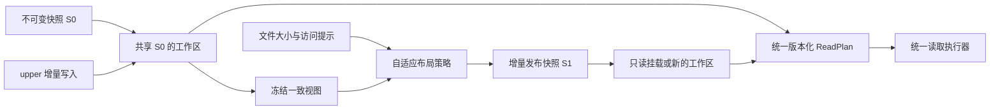

# BrewFS v3：增量工作区与自适应只读快照的统一设计

Status: **implementation in progress**

### 当前范围（2026-10-04 用户修正）

只完成 v3 及其三创新系统契约，以当前 wire 005 为唯一后续实现目标。
v2 独立产品、v1/v2/004 和旧 PM payload 兼容不再属于完成条件；无需为历史 reader
维护新布局的兼容分支。本文旧 wire 表格、兼容要求与历史 checkpoint 保留作记录，
与本段冲突时以本段为准。workspace/operator 的 v3 生命周期、完整 POSIX、预算、
认证、大目录与实验验收继续必需，不能用范围收敛代替这些实现。

### 当前元数据收尾状态（2026-10-07）

产品、公开 API、指标与实验统一称 packed-v3；005 仅为内部编码编号。
当前布局使用 PM11/IP06。Redis/TiKV 是发布、恢复、reader pin 与 GC 的元数据后端。
实际注册 PUT、原生 Quiesced fence、有界冻结视图导出/比较、DataDrained/Hashed CAS
与保守对象收集已接入开发树，当前完整回归正在执行。最终 native/packed 原子发布、
新进程取得新 lease 的恢复、history/snapshot/fork 的准确保留与 retirement、完整
FUSE 生命周期及最终门禁仍未签收。临时本地认证/排序存储不替代 Redis/TiKV。
当前结果与失败日志见
[元数据收尾开发验证](../../performance/packed-v3-metadata-closeout-validation-2026-10-07.md)。
以下 checkpoint 仅证明各自历史冻结输入，不代表当前树或全部 SPEC 已完成。

### 历史候选 checkpoint（2026-10-04 PM10/IP06）

活跃候选只接受005 envelope的PM10 manifest与IP06索引，旧PM07/08/09/IP05明确拒绝；
fixture默认且仅生成packed-v3。CLI/YAML中的packed独立v1/v2以及v3入口的004/未知magic
均拒绝。该冻结批次45项完整门禁及8次bounded实挂载通过；36k首次导入600秒超时。
新root-FD/Btrfs冻结源及索引seek批次独立46项检查、8次FUSE、3项真实Btrfs库测试通过，
366源码/固定binary/cleanup核对见[冻结源checkpoint](../../performance/packed-v3-frozen-source-seek-validation-2026-10-04.md)。
该阶段36k重验仍600秒超时、未挂载；后续有界source库存事务批次已通过47项gate02、
14次固定binary实挂载证据核对与3项新库真实Btrfs测试，详见
[源库存checkpoint](../../performance/packed-v3-source-batch-validation-2026-10-04.md)。
相同36k期限内raw/zstd导入/分页cookie/active fd/fresh restart/20秒卸载通过，typed GET图、
真实eviction与完整大规模内存出口仍开放。磁盘恢复后旧失败/tmp work已缺失，持久日志/
诊断保留且新checkpoint记录retention限制。尚未发布，S/X与全SPEC仍未签收。

PM10固定group_dentry_count:u64与必需counted-groups feature，source/allocation与
external placement由明确required feature表示。IP06每个child带正subtree_weight，
Groups叶子从GR05.entry_count导出权重，其余index叶子为1；checked sum以及所选child
的精确kind/height/fence/weight必须闭合。目录分页以prefix rank + u64 ordinal直接
select，并保留有界路径栈向后访问所需group，历史线性扫描路径不再用于005。
最大ordinal为i64::MAX-2。真实源.stats计入entry，虚拟.stats不占readdir cookie。

Linux只读ACL应用及default bytes保留已实现，cold/context认证和hot/backend错误按
EIO传播已通过真实故障挂载验证；可写继承/chmod/原子mode+xattr仍开放。
现有getattr仅在真实缺失时使用已删除handle属性，认证/backend失败不再误报成功。
该批候选与证据边界见
[PM10/errno验证](../../performance/packed-v3-pagination-errno-validation-2026-10-04.md)。

### 版本契约与完成门禁（2026-10-03 SPEC review）

本文历史区分逻辑架构 **v3**、wire **004** 和 **005**。当前实现统一围绕 005；
新布局仍须明确版本与篡改/边界测试，旧格式回读不再是接受条件。
功能实现、正确性验收、性能验收是三个独立状态。

本文的 **当前实现** 指现有 worktree（基于 `a429b0e`，新增代码尚未提交），不是
一个已发布版本。§4–5 定义 004/005 的各自 wire 契约；§6–10 中标为 **目标门禁**
的约束必须实现与验收，不能由现有单测推断已满足。顶部检查表是唯一当前状态汇总；
旧 checkpoint/实验保持历史时间和版本范围。审查记录见
[2026-10-03-packed-v3-spec-review.md](../plans/2026-10-03-packed-v3-spec-review.md)。

接手后的逐项差距、实现依赖和证据边界见
[SPEC差距审计](../plans/2026-10-03-packed-v3-spec-gap-audit.md)；三创新的因果消融和
生命周期实验见[更新实验方案](../plans/2026-10-03-brewfs-three-innovations-experiment-plan.md)。
后续代码批次已补齐GM07/IL05负向语义校验，并增加有界Linux单文件真实捕获与raw-name
权限路径修复；raw/zstd源文件及100/1,000文件实挂载回读通过。具体门禁与范围见
[source correctness checkpoint](../../performance/packed-v3-source-validation-2026-10-03.md)。
后续PM08/RA05/SI05认证root/allocated blocks与有界真实目录inventory已通过验收：
raw/zstd各540 entries、完整/partial回读、special/rdev、树内hardlinks与九类EROFS；
40项最终本地gate通过，证据见[namespace报告](../../performance/packed-v3-namespace-validation-2026-10-04.md)。
raw xattr字节传递、源.stats优先和removexattr EROFS随后通过独立40项gate及四次FUSE，
见[名称边界报告](../../performance/packed-v3-namespace-posix-validation-2026-10-04.md)。
PM09/EX09外部大文件已接通并通过40项最终gate、6项CLI和4次真实FUSE；raw/zstd分别
验证68 MiB dense、72 MiB all-hole、300段sparse与跨目录hardlinks，见
[external报告](../../performance/packed-v3-external-validation-2026-10-04.md)。
一致性仍为显式best-effort-detected，不是原子snapshot；ACL/其他raw mutation/PATH_MAX
及workspace生命周期仍开放，见[全部SPEC持续目标](../plans/2026-10-04-brewfs-all-spec-completion.md)。
实验设计完成不表示这些实现目标完成。


| 契约 | 历史004（已移出范围） | wire 005（显式实现/继续补全） |
| --- | --- | --- |
| envelope | `BRFPM004`/`BRFGC004`，64 B header/footer | 独立 `BRFPM005`/`BRFGC005`/`BRFCA005`，4 KiB header、64 B footer |
| payload | PM06/GC04/GM05、GM06/II05；raw frame | 独立 payload 版本；GM07 restart（32 条）、独立 raw/zstd block/frame |
| range 认证 | GroupMeta/index 有可信 ref；frame descriptor 尚无 manifest 认证链 | manifest 绑定有界 descriptor 页，认证后才使用 offset/codec/length/digest |
| 文件 placement | GM06 最多 1024 extents | GM07最多256 extent records；有界source importer超logical/data/extent admission限制自动生成PM09 external selector与分页LE09/LD05。旧bounded capture API仍明确拒绝超限 |
| 冷属性/反向索引 | 尚未实现 | inode-bound cold attributes、跨 group hardlink placement 和 pageable reverse names |
| 布局参数 | PM06 固化 profile/size table；构建策略来自 writer | PM07 当前只固化 profile/size table。每个 block/frame 保存实际 codec；group targets、inline/static/p90 policy 尚未完整持久化 |

005 envelope 的固定字段约定：header magic/version/header length/features/object
length/body offset/stored/raw length/hash id/body codec/CRC 位于前 64 B，其余 4032 B
必须为零。footer 为 magic 8 B、object length 8 B、body SHA-256 32 B、header
SHA-256 的前 16 B；完整对象 ref 再以 32 B SHA-256 固定所有字节。独立 descriptor
页使用 `BRFFD005`/FD05，外部数据对象和 hardlink reverse index 分别使用
`BRFLD005`、`BRFRI005`。PM07 roots、IP05 分页路由、GC05/GM07 压缩 builder 与
分批 producer 已通过库链路回归；005 已显式接入现有 readonly FUSE facade，并通过
100/1k/10k 实挂载回读；其后 005 已通过 prepared unified plan 直接接入 VFS，
不再在生产数据读路径使用 synthetic slices。CA05 冷属性和跨 group hardlink
反向索引已回归与实挂载验证；完整 source inventory、workspace head-CAS 与
生命周期仍未完成，不代表 004 range 已具备完整认证。

005 的认证入口是已固定的 **manifest content digest**，不是可复用的 snapshot id。
`ReadGeneration.lower_snapshot` 必须绑定该内容身份；descriptor、cold、large-object、
index refs 的 key/range/digest 必须闭合到该入口。页目录和 roots 同样有字节上限，不能
为大目录在 mount 时加载全部页引用。未知 required feature 返回 UnsupportedFormat。

4 KiB header、GM07 restart、CA05 和独立压缩属于 005 已实现契约，不是 004
的当前事实；外部 large DataRef、完整 source inventory 与 workspace 发布仍是目标。
不得在旧 magic 下收紧/放宽限制来偷换 wire，新增 required feature 或字段必须有
明确版本/迁移/拒绝规则。

GM07 当前独立 codec 使用 16 B header（magic/count/interval=32/run count），其后
是每个 run 的 canonical offset/length 目录，每 run 复用 GM06 的固定记录编码并重新
建立名称前缀基点；跨 run 仍校验名称全局有序。GM05/GM06 decoder 不自动接受 GM07。
005 block compression 在该 bounded raw page 外独立应用，不改变 legacy writer。

PM07 的 body 上限为 64 KiB，固定七个 typed roots（groups、inodes、containers、
frames、cold attributes、reverse names、large placements），不保存全量 refs。
每个根指向有认证 SHA-256 的 IP05 页，页最多 256 KiB/1024 records/16 层；branch
固定 child ref 和 first/last key fences，reader 验证 child 的高度与精确 fences。
frame root 的 leaf key 是 `(container_ordinal_be, frame_ordinal_be)` 区间，value 是
FD05 页 ref；container root 以 ordinal 路由到 immutable container ref。其他 roots
使用相同有界树，leaf 的具体 value codec 按对象类型校验，不隐含 KV fallback。
GC05 每个 metadata block 使用 GM07 后独立 raw/zstd 编码，stored/raw 各限制
256 KiB；每个 frame 无跨帧压缩状态。上传完成后经 bounded range 回读校验，索引
和 manifest 最后写入。producer 返回 manifest ref 不等于 workspace head-CAS 成功。

CA05 cold-index 以 inode 路由到独立认证对象；symlink target 保留原始 bytes，
xattrs 按 raw name 排序、ACL 按 type/qualifier 排序，单对象 body 256 KiB。
反向名称 key 为 `(inode_be, parent_inode_be, raw_name)`，保持 inode 身份而非内容去重。
producer 校验属性/逻辑数据 runs 一致并检查 visible dentries/nlink 闭合；每个 dentry
保留 placement，inode root 发布稳定 master locator。reader 提供 bounded reverse
cursor，旧 Vec API 对超过 4096 names/256 KiB 的集合明确拒绝而非截断。
ACL rules 的编码/查询不等于 Linux POSIX-ACL xattr 权限应用/继承已实现；后者仍待验收。

#### 实施与证据清单

| 项目 | 代码入口 | 完成条件 | 当前状态 |
| --- | --- | --- | --- |
| EIO 前置门禁 | S3 adapter、readonly、catalog；Compose/scanner | 小复现和 10k budget-churn 无错误，错误分类与正常卸载证据 | 本地 proxy-associated 502 已隔离；无代理 10k stat/full 无错误，其他 EIO 仍需逐案诊断 |
| 认证目录与 codec/restart | wire/group/meta/index/remote | packed-v3 round-trip、旧格式拒绝、descriptor+payload 联合篡改拒绝、bounded decode | PM07→IP05→descriptor→payload 及 GC05/GM07 producer 已实现；005 readonly FUSE 通过 10k 回读，其后直接统一 provider 经 1k 验证；workspace generation 接线待完成 |
| 完整 inventory | production builder、fixture、cold/large/readonly | sparse、hardlink、raw names、冷属性、外部大文件实挂载回读 | PM08有界namespace与PM09 external已验证；root/blocks/raw names/specials/cold/alias策略保持；最新40项gate/overlay1,328、6项CLI与4次FUSE通过。原子frozen view、ACL/其他raw mutation/PATH_MAX仍待完成 |
| 统一 executor | chunk/read_plan、VFS reader/backend | readonly/workspace 共用 executor；typed stale generation 整体有界重试 | 005 prepared UnifiedReadPlan/source fetcher 已直接接入 VFS 并验证；mutable workspace typed stale-generation 整体重试待完成 |
| 预算与统计 | coordinator/remote/catalog/metrics、VFS stats | 排队至最后消费者释放均计量；完整实际请求图经 `.stats` 导出 | 004 counters、005 runtime backend 实际接收字节接入 `.stats`；manifest/SDK retry、metadata/payload/inline 分类、raw overscan 与全程共享预算待完成 |
| workspace 生命周期 | meta_layer/resolver/lifecycle/stores/compaction/gc | 双 workspace 隔离、lower fallback、seal/head-CAS、故障恢复、可达性 GC | 待实现 |
| 因果消融与性能 | Compose/Aliyun runner、shared scanner | static/dynamic × native/packed 同 executor；10k strict-cold paired 对照和生命周期总成本 | 历史结果保留，新验收待完成 |

验收时补充具体测试名、revision 和 artifact 路径；仅补单测或仅写设计不能将实挂载/
生命周期项目标为完成。P0–P6 都是交付范围。性能规模按 tiny→10k→100k→1M 递进，
已有 JuiceFS 百万结果可复用但必须注明 TTL/inline 的历史限制，不能重复导入制造噪声。

最新 cold/hardlink/直接 VFS 阶段见
[`packed-v3-cold-hardlink-validation-2026-10-03.md`](../../performance/packed-v3-cold-hardlink-validation-2026-10-03.md)。
当前阶段证据及未完成边界见
[`packed-v3-completion-correctness-2026-10-02.md`](../../performance/packed-v3-completion-correctness-2026-10-02.md)。

### Legacy 004 implementation checkpoint（2026-10-02 前置复核）

本 SPEC 同时记录版本化格式与目标契约；“目标契约”不等于当前代码已经全部实现。下表记录
本轮补全之前的 **legacy 004 基线**；新增 005 的状态以上方证据清单和阶段报告为准，
不能将新增库 API 的状态套用到仍使用 004 的 FUSE 性能结果：

| 能力 | 当前状态 | 代码事实/限制 |
| --- | --- | --- |
| PM/GC/GM/II wire、digest、边界校验 | 部分认证链已实现 | `BRFPM004`/`BRFGC004`、`PM06`/`GC04`/`GM06`/`II05` 使用独立 magic；64-byte header/footer。完整本地 container open 校验 body/footer/group digest；strict range 校验 GroupMeta 和 frame bytes，但 frame descriptor table 未通过 manifest ref 独立认证，不能称完整 container 端到端认证。 |
| pageable group/inode index、bounded GroupMeta | 已实现 | 大快照使用 page refs；GroupMeta hard limit 为 256 KiB，目录/索引页仍按当前实现的记录上限分页；catalog 以 byte budget 保留 index page、GroupMeta、inode entry 和 hot inode locator，并在热路径共享 Arc。metadata warm-up 会先选稳定预算前缀，再按 container 合并相邻 GroupMeta range（最多 8 MiB、空洞最多 64 KiB）；warm GroupMeta 时按独立 locator 子预算 admission 热 inode locator，II05 的 `entry_ordinal` 直接定位 entry 并保留 name/inode 校验；readdir 深分页用认证的 `entry_count` 跳过前置 group，strict-cold demand read 仍只取引用的 group。 |
| dynamic frame 和 `<256 KiB` inline payload | 核心构建/回读已实现，完整目标未完成 | 按 size/profile/p90 选择 frame，同类 co-pack、跨 frame extents、inline 每 group 224 KiB；raw codec `0`。联合回归覆盖 200 KiB/512 KiB/1 MiB/10 MiB/32 MiB、random/sequential 和跨 frame 读取；fixture 仍限 4 MiB 且 p90=None，external large DataRef、sparse producer、完整 FUSE size-class corpus 尚未完成。 |
| bounded streaming range | 部分实现（strict payload 已增强） | `ObjectBackend::get_object_range_stream` 和 `read_exact_range` 只消费声明的 range；strict/coalesced frame path 现在逐 chunk 分发到独立 frame buffer、逐 frame 校验 digest，避免把 coalesced overscan range 累积为完整 `Vec`；metadata helper 仍返回 bounded `Vec`，window-cache opt-in 仍保留完整对齐窗口，因此 SPEC 7.6 的全路径零拷贝/压缩解码尚未完成。 |
| GroupMeta/GroupContainer 压缩、restart table | **未实现** | 当前 GroupMeta 是前缀压缩 + 固定宽度字段，body 和 frame 都是 uncompressed；没有每 32 条 restart table。zstd/restart 是后续 wire 版本或兼容扩展，不能写成当前性能事实。 |
| 跨 FUSE 请求的 coalesce delay/group window | 已实现（demand coalescing） | `SharedGroupReadCoordinator` 在 mount 级维护 pending queue，并以 **250 µs** 收集窗口按 container/profile 合并已提交 frame；共享 4 MiB window cache 和可选 next-window read-ahead 仍是独立的 cold-pipelined 能力。 |
| cold attributes (`BRFCA004`) | **未实现** | 当前只读适配器提供热属性；xattr/ACL/symlink target 的独立 cold-attribute 对象尚未发布或读取。 |
| packed 专用 metrics | 部分实现 | mount-scoped `PackedRuntimeMetrics` 已记录 data range GET/bytes、logical/overscan、decoded frames/size class、coalesced/singleflight、pipeline peak、window hit/miss/fetch、decoded-frame cache configured/resident/hit/miss/eviction 和 data-cache hit，并在 packed mount 卸载日志输出；`.stats`/Prometheus sink、metadata/data 完整请求图和 prefetch 全字段仍需补齐。 |
| overlay-workspace lower binding | **部分实现** | `ReadGeneration`、`ReadSource` 和 `compose_overlay_plan` 已存在；v3 readonly mount 已接入，但 workspace lifecycle 尚未把 packed lower 完整接入 P5 的 upper/lower resolver。 |
| 共享窗口 byte budget | 已实现 | window cache 在 catalog/mount 级创建并由所有 container 复用；预算不是每个 container 一份。coordinator 的 data/range permits 也按 batch 共享；双 container 回归测试锁定这一点。 |


### Implementation update (2026-09-30)

The strict payload path now consumes bounded object streams chunk by chunk and
routes coalesced chunks directly into requested frame buffers. It still keeps a
bounded `Vec` compatibility wrapper for metadata reads and an explicit full
window for the opt-in window cache. Runtime read metrics are mount-scoped and
logged, but are not yet exported through `.stats`/Prometheus. The 004 wire
formats remain unchanged: cold attributes, compression/restart and complete
workspace lower binding require explicit follow-up versions/adapters.

范围以本检查表为准。`strict-cold` 结果可以包含只针对已提交请求的 demand coalescing，
但不能隐含 GroupMeta 压缩或 BRFCA 读取；`cold-pipelined` 结果必须明确标注当前的
mount window/read-ahead 实现。
### 历史：2026-10-02 联合审查与实验门禁（004 基线）

- dynamic block 的 selector/packer 已接入实际只读 catalog/coordinator；不是所有文件固定 4 MiB，也不是三个创新点的完整生命周期已经落地。
- 当前 random group target/max 为 16/32 MiB、512 entries，sequential 为 32/48 MiB、1024 entries；container target 分别 32/48 MiB。第 6 节的 8/16 MiB、256 entries、16 MiB container 是目标默认，不是所有已发布 profile 的当前参数。
- GM06允许最多1024 extents；当时256目标尚未接通。新增GM07的256 extent-record cap与external fallback状态以§5.2为准。不能直接修改 GM06 限制而破坏旧对象回读。
- standalone FUSE 的 legacy slice facade 最终进入 packed unified plan；P5 的 upper/lower fallback、generation retry 和 seal/repack/head-CAS 尚未接通到 workspace 生命周期。
- inline payload 与 GroupMeta 共传输、共占预算。metadata-only 的 `data_range_gets=0` 不代表没有通过 GroupMeta 下载 inline 文件内容。
- 本轮 index-budget 候选虽通过页驻留回归，但本地旧基线和候选的 constrained-budget FUSE stat 都有 EIO，候选生产代码已回退。不得据此更新吞吐表。
- cloud runner 的 TTL 变量与 FUSE 变量不一致；已增加实际进程环境桥接和回归。旧实验“双方 TTL 对称”的结论需要重新验证，保留原始数字而不泛化缓存公平性。

完整消融和生命周期规划见
[`2026-10-02-brewfs-three-innovations-experiment-plan.md`](../plans/2026-10-02-brewfs-three-innovations-experiment-plan.md)。

Owner: BrewFS workspace / packed read path
Scope: mutable workspaces, immutable snapshots, and adaptive physical layout on S3/OSS

当前代码已经落地 wire/container、GM06 GroupMeta、动态 frame packer、分页 index、
bounded remote frame descriptor 读取、group catalog lookup 和统一 `UnifiedReadPlan`。
PM06 manifest 已固化 root identity，并为 group/inode index page 携带有序路由 fence；
II05 inode index 和 GM06 GroupMeta 已包含 parent/POSIX 热属性。只读 FUSE mount 现在
通过 `PackedV3ReadonlyMeta` 和 `PackedV3BlockStore` 接入：目录页只取有限 group，数据
读取由 inode/chunk 转为 packed frame plan，写入操作明确拒绝。性能对比仍需在真实挂载
和同等冷读条件下进行，不能用 wire 层 probe 数字替代端到端结果。

非根目录的稳定 `DirKey` 使用
`SHA256("BrewFS-packed-v3-directory\\0" || snapshot_id || inode_le)` 派生；根目录 key
仍由 manifest 显式保存。`packed_v3_snapshot_fixture` 会按目录生成独立 GroupContainer，
并发布 group/inode pageable indexes，可用于本地和 OSS 冷读测试。

当前实现与验收只支持 packed-v3。v1/v2/004 对象在当前入口明确拒绝，不提供兼容
读取或自动迁移。未知 manifest/object magic 返回 `UnsupportedFormat`，不能猜测
其他格式或退回 Redis/TiKV。

### 规范职责与优先级

- 本文负责 packed-v3 当前对象编码、只读解析、动态布局和 packed workspace 组合
  契约。历史格式表用于解释旧证据，不要求兼容读取。
- [workspace-v1 SPEC](2026-08-23-brewfs-workspace-overlay-implementation-spec.md)
  负责既有 layer/lease/delta/seal 控制面；当前 `BaseRevision` 不是 PM07 manifest ref。
- [clustered-v2 SPEC](2026-08-24-brewfs-clustered-frozen-metadata-v2.md) 仅对 v2
  规范生效；[large-directory note](2026-09-22-brewfs-packed-metadata-large-directory.md)
  是历史动机，不可据其参数覆盖本文。
- [operator lifecycle SPEC](2026-09-03-brewfs-workspace-operator-lifecycle-spec.md)
  定义 workspace-v1 CR/lease/Ready 语义；packed lower、head binding 和 GC refs 的
  接入需单独 capability/version，不因本地 readonly mount 成功而自动支持。

## 0. 统一主张和三项贡献

**同一份数据在可修改阶段只记录增量，在冻结发布时形成按访问粒度布局的不可变快照；
所有阶段通过同一套带版本的逻辑区间和读取计划访问。** 这是 v3 的整体设计主张。

| 用户定义的创新点 | 在数据生命周期中的责任 | 与另外两项的连接 |
| --- | --- | --- |
| **1. overlay-workspace** | 对共享快照 fork 出隔离工作区，只保存新增/覆盖/删除 | upper 与 lower 都解析为逻辑区间；冻结后的有效视图成为下一份 packed snapshot |
| **2. readonly-packed** | 将目录窗口、热属性和物理定位保存为有界可读的快照 | 同时是训练/推理的只读数据源和 workspace 的 lower；读取不依赖 lower KV 记录 |
| **3. dynamic block** | 在导入/冻结/重布局时选择独立解码单元的大小 | 将同一逻辑区间映射到变长 frame；read plan 隔离 upper block 和 lower frame 的差异 |



这三项能力的合成边界可以写成一个不变量：

```text
effective_view(g) = apply(upper_delta[g], lower_snapshot[g.lower_digest])
published_snapshot = pack(seal(effective_view(g)), layout_profile)
read(request) = execute(resolve(request, pinned_generation(g)))
```

其中 `upper_delta` 只负责“哪些逻辑区间被新增、覆盖或打洞”，`lower_snapshot` 只负责
“未被覆盖的完整有效视图如何分页和放置”，`layout_profile` 只负责冻结时把有效区间
放进哪一种 immutable frame。三者共享 `ReadGeneration`、逻辑区间和 `ReadSource`，
因此不会出现 overlay 自己一套定位、packed 自己一套定位、dynamic block 再绕开两者
的第四条读路径。只读挂载把 `upper_delta` 设为空；可写工作区把同一份 lower 放到
resolver 的 fallback 分支；seal/compact 则把 resolver 能看到的有效视图交给 builder。

实现上要坚持四个边界：

* dynamic block 不能改变 POSIX 文件偏移、VFS chunk 或 upper dirty block 的语义；它只
  选择 `PackedFrame` 的物理范围；
* lower 永远不可变，upper 的 mutation 不直接改写 GroupContainer；
* 一个 read 只绑定一个 `(workspace_head_epoch, lower_snapshot_digest)`，计划失效时整
  体重试，不能拼接两个 generation；
* 只读 lower 不启动 Redis/TiKV。可写 workspace 是否使用 KV 是控制面选择，不应渗入
  packed data read path。

**增量发布目标（尚未实现）**：S1 复用 S0 未修改且仍可达的对象/索引页；修改范围
若影响同一压缩 frame，至少需重新编码该独立 frame，当前 GC05 布局可能需重写受影响
container 和引用页。不能承诺任意 4 KiB 修改只产生 4 KiB PUT，也不能为小改动重建
整目录/整快照；同时报告重写 bytes 和复用比例。
独立只读挂载就是这个架构中 `upper=None` 的实例，共享下层执行器，完全跳过 upper
探测和 KV 连接。可写 workspace 的控制面仍可使用 Redis/TiKV，不能把“只读 lower
不依赖 KV”宣传成整个可写系统没有 KV。

统一的对象是 **文件身份、逻辑区间、版本和发布协议**。upper 的写入缓冲、lower 的
解码 frame、S3 对象、一次 GET 的范围分别优化；无需把它们强制设成同一个大小。
overlay、packing、可变块本身均已有先例，本文凝练的是三者的工程组合及可验证收益，
不在缺少相关工作比较时宣称各单项算法是首次提出。

## 1. 结论先行

v2 的主要限制不是 namespace、extent 或 DataPack 没有分页，而是分页后的读路径仍然
按“一个 inode、一个 slice、一个 frame”串起多个远程定位动作：

```text
v2 directory page
  -> per-entry namespace lookup
  -> per-file extent index lookup
  -> extent batch
  -> slice page
  -> frame page
  -> object page
  -> DataPack header (first use of an object)
  -> one frame Range GET
```

以下是2026-09设计输入时的v2路径观察，不对后续v3 cache能力或任意v2 tip做断言。
该路径的100KiB文件不能仅从目录记录直接读出数据；当时该v2路径还没有
decoded frame cache；相邻文件即使共享同一个 1 MiB frame，也会重复发起 frame Range
GET。当前 v2 fixture 的 `DataPack` frame 目标约为 1 MiB，而 `RemoteDataPack::read_frame`
每次调用都会分配一个新的 frame buffer 并读取整个 frame。

v3 的核心改变是把 **目录可见的热元数据、文件数据放置和可读计划** 放进同一个有界
的 `ReadGroup`，再把多个逻辑 `ReadGroup` 共置在一个 `GroupContainer` 对象中。数据
frame 按文件大小和访问意图选择有限的 size class，与对象和 GET 的大小解耦。
这针对 v2 当前固定 1 MiB frame 的重复读取问题；不能把 JuiceFS 默认 4 MiB block
理解为每个小文件必然填充或下载 4 MiB，比较必须测量真实对象长度和读取字节。

```text
trusted manifest ref / caller-pinned SHA-256 CAS key
  -> BRFPM005 / PM07, PM08, PM09 (typed roots and versioned source extensions)
       -> BRFGI005 / IP05 -> GR05 -> GroupMeta precise range in BRFGC005
       -> BRFII005 / IP05 -> IL05 (hot attrs + canonical GR05 locator)
       -> BRFCI005 / IP05 -> OR05 container ref
       -> BRFFI005 / IP05 -> OR05 BRFFD005 / FD05 descriptor page
       -> BRFAI005 / IP05 -> OR05 BRFCA005 / CA05 (explicit cold requests)
       -> BRFRI005 / IP05 (reverse dentry names)
       -> BRFLI005 / IP05 (PM09 required PS09 selector -> nested LE09 -> BRFLD005/FD05)
       -> BRFSI005 / IP05 (PM08/PM09 required SI05 allocations; root attrs in RA05)
  -> authenticated metadata/descriptor stored digest
  -> exact frame range -> verify stored bytes -> bounded independent decode
```

004 保留 PM06/GI04/II05/GC04/GM05、GM06 的旧对象图；frame table 自校验不等于
上图的 manifest-bound descriptor 认证。footer/full-object 校验是独立操作，不能用
只读了一个 payload range 的结果宣称已 scrub 整 container。

**请求图契约，而非“每文件固定两个 GET”承诺**：

- 冷 lookup 需沿 group IP05 路由树找 GR05，再查询 container root 并取精确
  GroupMeta range；树高度、已认证 page/locator 命中都影响实际 backend 次数。
- direct getattr 可以只用 IL05 hot attrs，不拉 GroupMeta/cold/data。inline read
  无独立 frame GET，但仍可能需要 inode/container index 和 GroupMeta GET。
- 普通 frame read 还需 frame-index 路由与 FD05 页，才可取精确 payload range；不能
  把 descriptor/索引 GET 隐藏在“一个 metadata block”中。已 warm/复用的 refs 命中
  与 metadata-cold 分别记录。现有手工 payload-chain 回归的 5 次请求只对应其小树
  fixture（manifest + container-index + frame-index + descriptor + payload），
  不包含完整 path lookup/open/GroupMeta 请求。
- 004 有 demand coalescing/window/decoded cache；005 当前 prepared read 逐需解析、
  拉 frame 并持有到 executor 完成，尚未接入跨 FUSE coalescing/prefetch/cache。
- 不再执行 v2 三张逐文件表查找是机制变化，不意味着所有冷请求数均少于 v2；优劣
  必须以相同路径、预算、codec 和 trace 的计数证据验收。

动态块大小只改变 immutable snapshot 的物理 frame，不改变 POSIX 看到的文件、逻辑
chunk 或 FUSE 接口。它是构建时的确定性选择，不是运行时把同一个文件切成不可预测的
大小；manifest 会公布 size-class 表，reader 只按已发布的 frame directory 读取。

这不是“物理打包后必然更快”的保证。若测试严格禁止预取、调用方一次只发一个文件
读请求，远程对象存储至少需要为每个不重叠请求付一次 RTT；任何格式都无法凭空消除
这个下界。v3 必须把严格冷读和允许有限请求流水线的冷读分开测量。

## 2. 真实 v2 证据和设计输入

现有证据必须保留在 v3 的评审上下文中：

| 观察 | 结论 |
| --- | --- |
| Aliyun 10,000 个 100 KiB 文件，v1 strict cold 约 48 files/s，JuiceFS strict 约 64 files/s | 紧凑元数据本身没有抵消每文件 OSS RTT；不能把 v1 结果写成 packed 领先 |
| v2 1,000 个 100 KiB 文件 smoke 完整校验通过，但约 30 files/s | v2 目前仍然走通用 VFS read 路径，未形成跨文件 read window |
| v2 ingest 将相邻文件写入共享 1 MiB frame | 物理共享已经存在，但 `read_frame` 没有跨请求复用 |
| `RemoteDataSeal` 保留 slice index、frame/object 页；paged slice lookup 每次仍 fetch 所选页，未缓存 decoded frame | 索引缓存、记录页缓存和数据复用是不同路径，必须分别计数 |
| `RemoteFrozenCatalog::page_entries` 读取 directory page 后逐项调用 `lookup_namespace` | 目录扫描存在可删除的重复元数据访问 |
| `RemoteDataBlockStore` 接收的是 `(slice_id, block_index)` | VFS 还不知道一个文件属于哪个可合并的物理 group |
| v2 runner 的 prefetch 默认关闭 | FUSE worker 并不会把单线程 Python 顺序扫描自动变成远程请求窗口 |

因此 v3 的验收对象不是“再做一个更大的 DataPack”，而是完整的请求图、放置索引和
读协调器。

## 3. 目标与非目标

### 3.1 目标

1. 支持 100 KiB 左右、百万级数量、深层目录和超大单目录的 immutable snapshot。
2. 路径 lookup、分页 readdir、getattr 和 read 使用同一份 GroupMeta 热记录，避免重复
   namespace/extent lookup。
3. 单文件随机打开只读取 bounded metadata 和所需 frame，不扫描整个目录或整个 group。
4. 顺序扫描能在明确开启的流水线模式下合并相邻 range，且 in-flight 内存有硬上限。
5. GroupContainer 的metadata、外部frame directory和data frame都可独立认证、分页和
   重新加载；挂载内存不会随快照文件总数线性增长。
6. 默认 benchmark fixture 使用独立、不可重复的文件内容；不得依赖跨文件内容去重或
   共享 `(slice_id, block, offset)` 制造命中。
7. 读取接口能记录 metadata GET、data GET、合并范围、overscan 和 pipeline 内存，
   使 cold/warm/pipelined 结果可复核。

### 3.2 非目标

* packed-v3 immutable对象不支持在线写入、rename 或 unlink；这些操作由
  overlay-workspace 的 upper layer 负责，commit 时离线生成新的 immutable snapshot。
* v3 不试图在一个对象中保存整个目录或整个快照；任何单次 range 都有明确的 byte、
  record 和 allocation 上限。
* v3 不承诺在“单线程、严格禁止任何预取、每次只读一个文件”的测试中少于一个
  payload RTT/file；该模式用于测量随机单文件延迟。
* v3 不把 S3 本地磁盘缓存、操作系统 page cache 或 decoded frame cache 当成格式能力。

### 3.3 overlay-workspace 的组合边界

overlay-workspace 不是把 packed lower 改成可写，而是给它增加一个独立的 mutable upper：

```text
read(inode, range)
  -> upper delta interval lookup
       ├─ fully covered: read upper block
       ├─ partially covered: read upper + lower and merge
       └─ uncovered: lower PackedReadPlan -> GroupReadCoordinator

write/create/rename/unlink
  -> upper metadata + upper dirty blocks
  -> workspace durable commit/drain (no automatic repack)
explicit seal/repack/publish [target]
  -> pin/quiesce consistent effective view
  -> v3 builder (size class + GroupContainer)
  -> verified BRFPM005 ref
  -> atomic head + packed-binding CAS
```

upper 可以继续使用 workspace 现有的 mutable metadata 和块管理；dynamic block 首先
作用于 lower immutable frames，commit/compaction 时再根据新 snapshot 的访问 profile
重新布局。upper 的 dirty bytes、最近上传 bytes 和 lower pipeline bytes 必须分别统计，
不能把 upper 命中误报成 packed data cache 命中。

overlay resolver 必须保留 snapshot identity 和 upper generation fence：一个 read 只能
观察到同一可见 mutation generation 的 upper delta 加同一份固定内容 digest 的 lower。
显式 packed publish 成功后新 lower
通过 head CAS 切换；旧 lower 仍可被现有 reader 继续读取，直到引用计数和 orphan
collector 允许回收。

### 3.4 一个统一生命周期

v3 不把 overlay、packed 和 dynamic block 当成三个并列挂载模式，而按以下生命周期
组合：

| 阶段 | 可见状态 | 使用的计划/布局 |
| --- | --- | --- |
| fork/mount workspace | immutable lower + writable upper | upper interval plan 覆盖 lower logical ranges |
| 普通读写 | upper 先解析，未覆盖范围落到 lower | upper block plan 与 lower packed plan 合并后执行 |
| quiesce/seal | 固定 workspace generation，禁止新的 upper mutation | 捕获完整 namespace、attributes、holes 和 data extents |
| repack/publish | 生成新 immutable snapshot | 依据 size class、codec 和访问 profile 写 GroupContainer |
| readonly mount | 只有已发布 snapshot | 直接走 GroupCatalog + GroupReadCoordinator |

`fsync`、普通 close 或单次 upper upload 只保证当前 workspace 的数据版本和 durable
barrier，不触发全量重打包。只有显式 seal/compact/publish 才生成新的 packed lower；
这样小范围修改的写延迟不会被百万文件的重布局拖住。

冻结时可以复用未受影响的旧 GroupContainer；受影响的 group 生成新对象，manifest
通过 CAS 指向新旧 group 的混合集合。只有当 size class 或目录边界发生变化时才重新
切分相邻 group，避免“改一个文件重写整个目录”。

## 4. 版本和对象图

### 4.1 格式分流与完整对象种类

当前入口只接受 packed-v3 当前编码。004 与未知 kind/version/required feature
必须 `UnsupportedFormat`；拒绝时不得猜成 v2 或回退 KV。native-base 的
`BRFSM003/BRFCL003/BRFDP003/BRFDS003` 和 v2 的对象不在此命名空间。

| 用途 | 历史 004（拒绝） | packed-v3 编码 / payload | 历史实现状态 |
| --- | --- | --- | --- |
| manifest | BRFPM004 / PM06 | BRFPM005 / PM07、PM08 | PM07及PM08 source-stat契约已验证；完整inventory/publish仍开放 |
| group container | BRFGC004 / GC04 | BRFGC005 / GC05 | 已实现 |
| group index | BRFGI004 / GI04 | BRFGI005 / IP05 | 已实现 |
| inode index/locator | BRFII004 / II05 | BRFII005 / IP05 + IL05 | 已实现 |
| container root | PM06 内联 container refs | BRFCI005 / IP05 + OR05 | 已实现 |
| frame root | 未认证 container table | BRFFI005 / IP05 + OR05 | 已实现 |
| frame descriptor page | GC04 table | BRFFD005 / FD05 | 已实现 |
| cold root/object | BRFCA004 仅预留 | BRFAI005 / IP05 + OR05；BRFCA005 / CA05 | 已实现 |
| reverse dentry root | 无完整反向表 | BRFRI005 / IP05 + IL05 | 已实现 |
| external placement root/object | 无 | PM09 required PS09 root、nested IP05/LE09；BRFLD005/LD05 + FD05 | 已实现并经raw/zstd真实FUSE验证；PM07/PM08不获得新解释 |
| source allocation root | 无 | BRFSI005 / IP05 + SI05，object kind=12 | PM08 required；库回归及single-file真实FUSE已验证 |
| footer | BRFEND04 | BRFEND05 | 各按自身版本解析 |

PM07 只含 snapshot/root identity、profile/size table 和七个 typed roots；完整 graph
closure、namespace/source 一致性是另一个发布门禁，`decode(manifest)` 不证明所有
children 已存在且相互一致。当前 005 CLI 用调用方选择的 SHA-256 CAS manifest key
作为信任锚，先 probe 64 B 再取 bounded manifest；其他调用入口必须先固定可信 ref。
响应中的 digest/key、CRC 或对象内自报 footer 不能自行建立信任。

#### PM08 source-stat 扩展（2026-10-04）

PM07 的字节和 synthetic-root/logical-block解释保持不变。需要真实根属性与源
allocated blocks 的writer生成 **PM08**；旧PM07 decoder的精确payload匹配将拒绝
PM08，新reader显式分流PM07/PM08，不按trailing bytes猜版本。不改004或旧workspace schema。

PM08在原七个roots之后追加固定 **RA05** 与 `u32 ref_length + OR05 allocation_ref`。
RA05依次为magic(4)、inode/size/blocks各u64、mode/uid/gid/nlink各u32、atime/mtime/ctime
各i64纳秒；根kind固定directory、rdev固定0，mode必须为合法directory类型，identity
必须与manifest root_inode相同。整个manifest body继续受64KiB限额约束。

allocation_ref必须指向 `BRFSI005/IP05`，kind=12。其key为`inode_be`，leaf value为
`SI05 + inode_u64_le + st_blocks_u64_le`（精确20B）；blocks单位为512B，与EOF、
frame stored/raw bytes独立。每个非根inode（含directory/special）有且只有一个匹配
record；root在RA05内，不再进入allocation index。producer闭合检查missing/orphan、
root复用为dentry、hardlink alias blocks冲突；失败/中断的更新不能finish。

PM08 getattr/open/lookup读取认证allocation页；record缺失、inode错绑、篡改或不支持
version都报错，禁止回退`size.div_ceil(512)`。readdirplus属性沿用stat入口。PM08根属性
直接来自manifest，不读取根GroupMeta；旧PM07继续使用合成根和logical blocks。
属性保存能力不建立目录原子快照，single-file source-parent捕获仍须明确其subset范围。
未来对象图验证/GC必须把allocation root作为额外依赖，不能只遍历原七个roots。

#### PM09 external placement 扩展（2026-10-04）

PM09保留PM08的七个roots、RA05及allocation ref，在末尾追加精确 `EX09 + u32(1)`。
flag=1为required regular-inode placement契约；缺失、未知flags、降级或trailing bytes
均拒绝。PM07/PM08的LargePlacements保留旧语义；新reader不根据空树猜是否支持大文件。
只有使用external的源导入切换为PM09，旧小文件导入继续生成PM08。

PM09 LargePlacements的key为`inode_be`；leaf value为PS09：magic(4)、inode_u64_le、
logical EOF_u64_le、kind_u8、reserved_zero(7)，Group kind=0的value精确28B。
External kind=1再追加data_bytes_u64_le、extent_count_u64_le、logical_digest(32)、
ref_length_u32_le及OR05嵌套BRFLI005/IP05 extent root。每个regular inode必须恰好有
一个匹配selector；nonregular/orphan/missing/size conflict阻止finish。External的
GM07只携带hot属性，不能同时携带inline/extents/flags。逻辑digest合并连续data runs，
按size及各run的start/length/SHA-256编码计算，frame/chunk/codec边界不改变inode身份。

嵌套IP05的key为`(inode_be,file_offset_be)`，last_key为同inode的inclusive end-1。
LE09精确40B：magic(4)、inode_u64_le、file_offset_u64_le，随后logical_len、container
ordinal、frame ordinal、raw_offset、raw_len各u32_le。key/fences必须与value精确匹配，
extent不能重叠、越EOF或越8 MiB raw帧上限。holes只来自认证tree中的缺口；all-hole
使用认证空tree和显式External selector，不能省略selector。

BRFLD005 body以LD05 magic(4)、inode_u64_le、chunk_id_u64_le、frame_count_u32_le、
raw_total_u64_le的32B prefix开始，随后为独立raw/zstd帧。chunk上限为raw16 MiB、
stored body24 MiB、1,024 frames；profile单帧cap仍为random4 MiB/sequential8 MiB。
压缩膨胀时FD05显式记录raw codec。每个chunk使用全局container ordinal，FD05保存
chunk digest/length及frame精确offset/length/digest，仍由manifest Containers/Frames
两棵认证树解析。external读取用overlap分页并进入原UnifiedReadPlan/executor；frame
集合key必须同时包含container和frame ordinal。

上述wire/source/reader已接通；最终门禁与真实FUSE证据见
[external验证记录](../../performance/packed-v3-external-validation-2026-10-04.md)。
source仍为明确的best-effort/stat检测，跨请求共享预算和workspace发布/GC各有独立出口。

### 4.2 Envelope 与 GC05 布局

004 为 64 B header + uncompressed body + 64 B footer，保持旧布局/限制不变。
005 为 4096 B header + raw outer body + 64 B footer；压缩只在独立 sub-block/frame。
所有整数 canonical little-endian；索引比较用有序的 key bytes（数值 key 用 big-endian）。

005 header 前 64 B 的字段为 magic(8)、major/minor(2/2)、header length(4)、features(8)、
object length(8)、body offset(8)、body stored/raw length(4/4)、hash id(1)、outer codec(1)、
reserved(10)、CRC32C(4)。其余 4032 B 必须为零。**没有** container id、group count、
区域目录或 size-class table id 字段，不能拿这些目标字段覆盖现有编码。
CRC 覆盖前 60 B；footer 保存 magic(8)、object length(8)、body SHA-256(32)、
完整 header SHA-256 的前 16 B。可信 object ref 再用完整 32 B SHA-256 绑定所有字节。

```text
BRFGC005 envelope header (4096 B)
GC05 body prefix (24 B): magic / container id / profile / reserved / group count / frame count
GC05 group directory: offsets, stored/raw metadata lengths, codec, counts, digest, parent/name fences
independently encoded GroupMeta blocks (raw GM07 or one zstd frame each)
independently encoded data frames
BRFEND05 footer (64 B)
```

frame descriptor 不在 GM07 中：独立 FD05 页从 PM07 frame root 认证。
GC05 body 当前 hard cap 为 **64 MiB body bytes**，因此完整对象上限是
`4096 + 64 MiB + 64`，不是恰好 64 MiB。64 MiB logical/raw input、stored body 与
producer峰值 allocation 是不同约束，不相互替代。group/container packing targets
属于构建策略，PM07 当前没有持久化全部 group targets 或 static/inline/p90 policy。
完整重布局/消融的策略记录仍是待实现门禁，不允许挂载参数改变已认证 placements。

### 4.3 认证 ref / root routing

OR05 value 保存 object kind、UTF-8 object key、object length、全对象 SHA-256；对象 key
与 raw POSIX name 是不同类型。005 当前要求非空合法相对 key、至多 4096 B，拒绝 NUL、
空路径段、`.`、`..`。这是 reader/worktree 的 key 契约，不对 legacy 004 key 重新解释。

IP05 页 body 最多 256 KiB/1024 records，key 最多 2048 B、leaf value 最多 8192 B、
最大 height=16（根 height 16 至 leaf 0，至多 17 页/route）。空 index 必须是 height=0。
branch 保存可信 child OR ref 与 first/last fences，必须有序/不相交；选中 child 的
kind、height-1 和精确 first/last 必须与 parent 一致。

| PM07 root | key/fence | leaf value |
| --- | --- | --- |
| Groups | parent DirKey + raw name 闭区间 | GR05 |
| Inodes | inode big-endian | IL05（hot attrs + canonical GR05） |
| Containers | container ordinal big-endian | OR05 container ref |
| Frames | container ordinal + frame ordinal big-endian 闭区间 | OR05 FD05 ref |
| ColdAttributes | inode big-endian | OR05 CA05 ref |
| ReverseNames | inode + parent inode big-endian + raw name | IL05 alias locator |
| LargePlacements | PM09 inode_be selector；nested inode_be + logical-offset_be extents | PS09 Group/External；LE09精确range leaf。PM07/PM08保留原解释，missing selector不作hole |

GR05 保存 group id(u64)、container ordinal(u32)、parent DirKey(32 B)、raw first/last name、
metadata offset(u64)、stored/raw length(u32/u32)、actual codec(u8)、stored metadata SHA-256、
entry count(u32)、first frame/frame count(u32/u32)。它**不含**独立 `data_offset/data_len`、
`data_digest`、file count 或 layout_profile；这些旧 PackedGroupRef 字段不属于 GR05。
GR05 digest 信任来自 group/inode IP05 leaf；metadata取精确 range、先验stored digest，
再 decode GM07 并核对 count/name/inode/extent边界，不能把不匹配 record 当 hole。

## 5. Metadata / frame / cold 属性的规范编码

### 5.1 GM05/GM06 兼容与 GM07 restart

legacy GM06 header 是 `magic/count/reserved` 共 12 B，前缀/后缀长度均为 u16；
GM05 少 inline length/payload 字段。GM04 仍拒绝。004 不因新增 GM07 而接受它。

005 raw GroupMeta 为 GM07：16 B header `magic/entry_count/interval=32/run_count`，
之后是每 run 的 u32 offset/length。目录必须连续、canonical、有界，每 run 自包含一个
GM06 编码的 ≤32 条记录、前缀从空基点重启。非末 run 恰好 32 条，末 run 按总count
校验；名称须跨 run 全局严格有序，不能靠 restart 丢掉全局查重。

**当前 run 记录顺序**：prefix/suffix(u16/u16)+suffix bytes、kind/flags(u8/u8)、
mode/uid/gid(u32)、rdev(u64)、nlink(u32)、atime/mtime/ctime(i64 ns)、inode/size(u64)、
extent count(u16)+extents、inline length(u32)+bytes。无 `file_record_id`、cold ordinal、
name arena/file table/descriptor offsets；新增这些字段需要显式 payload 版本，不得沿用
GM07 让 reader 猜测。kind 的 regular/dir/symlink/special 映射与 POSIX mode 一致性、未知
entry flags、root hot属性和 sparse blocks 的完整验收仍须逐项完成。

raw POSIX name 不做 UTF-8/lossy 转换、大小写折叠或 Unicode normalization，拒绝 NUL、
slash、空名、`.`、`..`。codec/name helper 当前 cap=1024 B；实际 FUSE component 的
NAME_MAX=255 B（见 `src/vfs/fs/mod.rs`），**不能宣称 1024 B component 可从 FUSE 打开**。
真实 importer 必须按运行平台的 name limit 明确拒绝，不能静默裁剪。

### 5.2 Extent、inline 与 sparse

每条 GM06/GM07 extent 恰好五个字段：file offset(u64)、logical length(u32)、frame ordinal(u32)、
raw offset(u32)、frame raw length(u32)。offset/stored length/class/codec/digest 来自可信 FD05，
不是从 extent 自报的重复字段猜测。raw offset + logical length 必须落在 frame raw length 内；
文件区间有序、不相交、不越 EOF。GM06 cap 1024 records；GM07 当前 cap 256 records，
不等于 256 个 distinct frames（共享 frame 可有多个 records）。超限当前 fail closed，
外部 pageable placement fallback 为未实现目标。

小于 256 KiB 的 regular file 可以 inline，同 group 总 inline raw bytes ≤224 KiB，仍须
满足全部名称/属性/extents/restart overhead 与 256 KiB metadata raw/stored cap。零长度
文件不必生成 data frame；inline flag/size/bytes 不一致必须拒绝。达到256KiB 不inline。

hole 是经过一致 source inventory/有效视图确认的无数据范围，absence 在 mutable upper
仍可能是 lower fallback，二者不可混淆。decoder 可以对已认证 sparse gaps 填零，不能
把 missing descriptor、短读、invalid index/ref 或未实现 external placement 当 sparse。
SEEK_DATA/SEEK_HOLE producer、超过容器预算的大文件、根/所有inode的真实 `st_blocks`
尚未完整实现；extent构造单测不等于这些源语义或FUSE功能已通过。

### 5.3 FD05、codec 与认证边界

FD05 body prefix 为80B：magic、container full digest/length、profile、reserved、size table、
first ordinal/count。每 descriptor 固定48B：ordinal(u32)、class/codec(u8/u8)、reserved(2)、
object offset(u64)、stored/raw length(u32/u32)、first/last file slot(u32/u32)、stored-frame
SHA-256前16B。每页≤4096 frames /256KiB body、ordinals连续、physical offsets有序不重叠，
所有ranges在container body内。page container/profile/table需与PM07的可信ref一致。

payload digest 认证的是 **stored bytes**（raw或zstd），不是尚未解码的 raw bytes。
独立zstd恰好一个 frame：拒绝trailing/concatenated frames、坏content length、超raw长度
或超history window；decode输出与raw_len精确一致。当前无额外raw digest字段，不把
stored digest+bounded decode写成另一项不存在的raw hash。raw codec要求stored_len=raw_len。
frame raw cap为8MiB，random/mixed C2/C3 cap4MiB、sequential cap8MiB；actual stored length
仍受range上限。压缩膨胀时writer对该data frame记录raw codec，不超限偷换descriptor。
metadata压缩超stored cap当前拒绝；未来fallback策略须明确记录。

没有跨frame压缩状态或隐含per-frame header/padding规范。合并range里的gap可以丢弃，
认证只覆盖声明的frame bytes；不能承诺“验证所有非零padding”，除非新版wire显式定义。

### 5.4 CA05、hardlink 与 POSIX 边界

CA05保存inode、optional raw symlink target、ordered xattrs和ordered ACL rules，独立body
≤256KiB；target≤4096B、不能为空/NUL，xattr name≤255B/value≤65536B，xattr/ACL counts
各≤1024。当前ACL为BrewFS `AclRule {type, qualifier, permissions}`，权限限制0..7。
raw readlink可经byte-safe FUSE路径返回；String API遇non-UTF8明确错误，不lossy。
xattr name兼容API仍使用String，不可借此声称任意raw xattr name已完整支持。

inode是hardlink身份，禁止content-dedup代替inode grouping；producer检查hot属性、逻辑
数据runs（含sparse边界）一致，物理offset/codec/inline与frame拆分不属于inode身份。
当前stable master locator按parent DirKey/raw name选择，reverse index才是完整别名列表。
重复directory inode禁止；非directory可见dentry数必须与published nlink闭合；cold target
缺失/错inode也拒绝manifest发布。同inodecold bytes完全一致可重用，否则拒绝。

**source导入目标**：完整namespace保留真实nlink；subtree导入必须显式选择“快照内可见
链接数”策略并记录 provenance，或因外部alias不闭合拒绝。当前producer要求输入nlink
与可见links一致，没有自动subtree重写或真实source inventory保证。目录nlink、root属性、
特殊inode/rdev、allocated blocks不能由该non-directory计数推导成已完整POSIX验收。

ACL编码/查询已实现；Linux POSIX ACL xattr、chmod联动、default inheritance与实际access
权限应用仍未实现，当前FUSE明确拒绝相关POSIX ACL xattrs，不可称“ACL完整通过”。
readonly mutation用EROFS；FUSE xattr size/data/ERANGE framing由checked-in asyncfuse补丁
回归验证。permissions/DAC先于只读层失败的情况与EROFS单独记录。

## 6. 分组和物理布局策略

### 6.1 逻辑 group 的边界

构建器先按 `(parent_dir_key, raw_name)` 排序，再按以下硬约束切分：

以下是保守 **目标构建 profile**，不是 PM07 字段表或对所有已发布对象的当前默认值。
004 的 `for_profile` 使用 random 16/32 MiB、512 entries，sequential 32/48 MiB、1024 entries；
当前005 fixture按约8MiB/256 inputs分批，producer没有完整持久化/静态布局控制。
参数都必须有明确单位、raw/stored/owned口径和发布provenance。

| 约束 | 目标值 | 作用 |
| --- | ---: | --- |
| `group_target_logical_bytes` | 8 MiB | 让顺序读取有足够的合并空间 |
| `group_max_logical_bytes` | 16 MiB | 限制构建group；不代表单次GET或overscan硬上限 |
| `group_max_files` | 256 | 防止大量零字节/极小文件挤占一个 group |
| `group_max_meta_raw_bytes` | 256 KiB | 保证单 group metadata bounded |
| `group_max_name_bytes` | ≤256 KiB raw metadata剩余预算 | 名称与固定字段/restart/extents共享page上限，不能另放1MiB name arena |
| `min_frame_raw_bytes` | 256 KiB | 避免极小 frame 放大 header/索引 |
| `max_frame_raw_bytes` | 8 MiB | 防止单次随机读过度拉取 |
| `max_inline_extent_records_per_file` | 256 | GM07嵌入记录限制；source超限自动使用PM09分页external，旧GM07 cap不增加 |
| `container_target_bytes` | 16 MiB | 目标对象大小，减少 OSS object 数量 |
| `container_max_body_bytes` | 64 MiB | 完整对象另加header/footer；单次range不等于整个object |

当前一个逻辑group恰好属于一个parent DirKey；tiny-directory **物理co-pack** 是
把不同parent的多个独立groups放入同一container，不把它们混成一个GM07。
同parent内group name fences必须不相交，不能靠运行时扫描/覆盖解决重叠。大目录按名字
窗口拆分，不按固定 inode 数量单独拆分，以便同一个目录的 readdir 顺序和 data 顺序一致。

### 6.2 size class 和动态 frame 选择

动态选择采用有限的 size class，而不是为每个文件生成一个任意的 block size。默认
size class 如下：

| class | 文件大小/访问量级 | random profile 的 frame 上限 | sequential profile 的 frame 上限 |
| --- | ---: | ---: | ---: |
| `C0-tiny` | `<=256 KiB` | 256 KiB | 256 KiB |
| `C1-small` | `256 KiB..1 MiB` | 1 MiB | 1 MiB |
| `C2-medium` | `1..16 MiB` | 4 MiB | 8 MiB |
| `C3-large` | `>16 MiB` | 4 MiB raw cap；external对象为目标 | 8 MiB raw cap；external对象为目标 |

对没有访问直方图的普通文件，builder 使用以下确定性规则：

```text
file_target = round_up_pow2(file_size, 256 KiB, profile.max_frame)
frame_count = ceil(file_size / file_target)
split logical data into independent frames of file_target (tail may be shorter)
```

因此非inline的200KiB文件通常选256KiB **target**，实际raw bytes可以为200KiB，
不能把target当固定填充/GET长度；1MiB文件选1MiB target。10MiB
文件在 random profile 下由最多 4 MiB 的 frame 组成，在 sequential profile 下最多
8 MiB。最后一个 frame 可以小于 class 上限，但不能小于 `min_frame_raw_bytes`，除非
它是文件尾部或稀疏范围的唯一 frame。

如果数据集提供历史 read histogram，`file_size` 可以替换为 `p90_requested_range`
参与选择：

```text
access_target = max(p90_requested_range, 256 KiB)
file_target = round_up_pow2(min(file_size, access_target), 256 KiB, profile.max_frame)
frame_count = ceil(file_size / file_target)
```

histogram来源、采集时期、sample_count和p90值必须在构建provenance中固定，不能用测试
请求反向选择“最佳”layout；当前fixture仍p90=None，PM07未持久化完整histogram policy。

这对 KV cache 很重要：一个 10 MiB 文件若通常只读取 64--200 KiB 的局部范围，应该
选择256KiB/1MiB级 **frame target**，而不是强制8MiB。当前 `SizeClass` 仍由文件大小
分类（10MiB仍是Medium）；p90不把文件重新标成Tiny/Small，统计标签必须区分file class
与actual raw frame长度。若没有可信的
直方图，v3 必须使用 size-only 规则，不能在挂载时猜测访问模式。

构建时同一frame只co-pack同class/target/profile且能共享一个实际codec的相邻文件；
codec选择/压缩膨胀fallback必须记入descriptor。**构建时不得**因为未来/已到达请求
而跨class混放。运行时可以在独立frame间合并GET，是另一个planner约束，不改变wire。这样 200 KiB 文件
不会因为旁边有 10 MiB 文件而被塞进大 frame，也不会制造数量无限的物理对象：多个
逻辑 group 仍然 co-pack 到有限数量的 GroupContainer。

### 6.3 小文件 frame profile

* `random-small-file` 的4×是eligible range合并判据，不是任意partial read的物理放大上限；
  C0/C1 文件保持单 frame，C2/C3 文件使用 4 MiB 独立 frames。
* `sequential-small-file` 允许 C2/C3 使用 8 MiB frame，并依靠
  `GroupReadCoordinator` 合并名字相邻的 frame；C0/C1 不为了“凑满 4 MiB”而跨 class
  强行扩大，因为 group-level window 已经承担 RTT 摊销。
* `mixed` 当前004 planner使用random/mixed的4×合并判据及4MiB C2/C3上限，
  不可写成已采用sequential 16×预算。005未接入该coordinator，参见§8支持矩阵。

profile 是发布时的格式字段。挂载不能通过改 `block_size` 假装改变 frame 形状；如果
同一份数据需要两种访问方式，应发布两个明确的 immutable layout profile 并分别测量。

### 6.4 动态 block 的收益边界

当对照实现实际按完整 4 MiB 物理范围读取时，200 KiB 的单文件随机读可能造成接近
20 倍的物理读取放大；如果对照能够发出精确 range，必须以实测 fetched bytes 为准，
不能把4MiB当JuiceFS每次读取的固定事实。200KiB完整读取256KiB以内frame时
raw放大可能接近1–2倍；4KiB partial read 同一256KiB frame仍可放大64倍。
stored wire压缩率与raw overfetch是不同量，不能据此保证任意C0请求≤2×。这会减少 OSS 传输量、解压 CPU
和无关数据占用，但不会自动减少每个文件的首个 RTT。顺序训练数据的吞吐仍依赖
GroupReadCoordinator 的有限窗口；如果严格禁止预取，动态 frame 主要改善 bytes 和
CPU，而不是 files/s。

动态 block 也有成本：frame 数、frame directory 和 digest 会增大，较小的独立 zstd
frame 可能压缩率更低。因此 builder 必须以 `metadata_bytes/logical_bytes`、
`fetched_bytes/logical_bytes` 和 `GETs/file` 三个约束共同选择 profile，不能只优化
单文件 overscan。

### 6.5 去重和公平性

v3 builder 默认不做跨文件内容 dedup。两个文件即使内容相同，也必须拥有独立的逻辑
file record 和可审计的 placement；如果未来提供 dedup profile，必须在 manifest 中显式
声明，并在性能报告中同时报告 unique logical bytes、physical bytes 和 dedup ratio。

### 6.6 百万文件的数量级估算

以下仅是给定目标profile、无特殊元数据/压缩/容器边界效应的估算，不是已实现对象数。
以 1,000,000 个 100 KiB 文件、`group_target_logical_bytes=8 MiB`、
`group_max_files=256` 为例，一个 group 大约包含 80 个文件，约有 12,500 个逻辑
group。若 `container_target_bytes=16 MiB`，物理对象数量大约是几千级，而不是一百万
级；一个 1,000-file leaf directory 大约拆成 13 个名字连续的 group。单目录一百万
entry 也只增加 group index 和 GroupMeta block 数量，readdir 仍按当前 name/ordinal
窗口读取。

相反，若目录只有一个或几个小文件，builder 可以把多个 tiny directory 的 GroupMeta
和 data frame 放进同一个 GroupContainer。逻辑 group 仍然按真实 `parent_dir_key`
隔离，物理 co-pack 只减少 object 数量，不改变 lookup 或权限语义。

## 7. v3 读路径

### 7.1 挂载

005 当前 CLI：probe 64B -> 从调用方CAS key固定digest -> 取≤64KiB body的完整manifest
range -> 验证envelope/ref/PM07。roots作为小refs保留，按需加载IP05，而非mount先扫
所有container/index sections；不读GroupMeta/cold/data、不初始化lower KV。
创建byte-weighted index cache和readonly provider。004仍走旧PM06/catalog路径及显式
metadata warm-up。005没有共用004 coordinator，不能用其permits/metrics解释005内存。

### 7.2 lookup 和 readdir

005 lookup沿group IP05查GR05、沿container root取OR05、读精确metadata range，核对
stored digest后解码GM07并返回hot entry。当前在解码后的entries中二分，**不是**仅从
restart跳到单条wire record的lazy lookup；restart限制的是名称前缀依赖，不免除block
解压/验证。缺失合法dentry可返回None，损坏route/ref/record不能返回None掩盖错误。

index scan提供first-key cursor和byte/record上限，所选child必须通过parent fence认证。
FUSE目录handle只返回paged raw entries。当前005/IP06已实现认证subtree count、prefix
rank和weighted ordinal select，沿有界树路径定位目标group，不扫描全部前置group refs。
库测试覆盖实际range GET上限与fresh-reader深cookie恢复；完整真实FUSE typed GET、
warm cursor eviction/refetch、hot protection和更大规模内存验收仍须完成。cookie必须可
重建并绑定generation/parent/root；恢复cookie不依赖挂载内无限map。

一次FUSE页可能跨多个groups，每组最多256KiB raw metadata，并受独立owned-output
预算限制；returned limit是最大值而非恰好数量。page满/budget满可提前返回并继续，
若单entry本身超budget则明确LimitExceeded，不能空页假装EOF。不得逐entry回查namespace。

### 7.3 getattr、hardlink 和 cold attribute

- 005 direct getattr由IL05 hot attrs解析；PM08另读认证allocation index，不加载GroupMeta/cold/data；004已有独立
  locator/inode-entry caches，005当前主要是IP05 page cache，两者支持范围不同。
- PM07仍提供synthetic根与`blocks=size.div_ceil(512)`；PM08提供认证root attrs与SI05
  allocated blocks。single-file/parent捕获不等于完整namespace、目录nlink策略与一致source验收。
- CA05只在raw readlink/xattr/ACL API查询时读取；普通文件读取不加载cold root。
  raw文件名与raw symlink bytes必须保留；String兼容API不能lossy折叠。
- 完整hardlink枚举依赖认证reverse index，**不能**用“当前已观察的链接列表”冒充完整
  names_for_inode。稳定master locator用于read/getattr，但不代替reverse membership。
- Vec names/path API是有界兼容接口（当前4096 names/256KiB等限制），超限明确失败；
  完整枚举用paged raw cursor。ACL lookup与POSIX ACL应用边界见§5.4。

### 7.4 统一逻辑读取计划

v3 不再把 packed 文件读取做成一套绕过 workspace 的新 executor，也不把 v3 物理
frame 伪装成 v2 `(slice_id, block_index)`。三种创新点通过一个两层计划合成：

1. **逻辑层**只描述请求范围、generation 和不重叠的输出区间；
2. **物理来源层**描述该区间由 upper mutable block、v2 slice、v3 packed frame 或
   hole 提供。

当前中立类型位于 `src/chunk/read_plan.rs`。以下是语义示例，不替代wire/持久schema；
legacy `ResolvedReadPlan` 仍只有slices/zero，新的统一类型为 `UnifiedReadPlan`：

```rust
struct ReadGeneration {
    workspace_head_epoch: u64,
    lower_snapshot: [u8; 32], // pinned manifest content identity; not fixture snapshot_id
}

struct UnifiedReadPlan {
    generation: ReadGeneration,
    logical_size: u64,
    segments: Vec<LogicalSegment>, // sorted, disjoint, inside the request
}

struct LogicalSegment {
    logical_offset: u64,
    length: u64,
    source: ReadSource,
}

enum ReadSource {
    Hole,
    UpperBlock { key: BlockKey, block_offset: u64 },
    LegacySlice { slice_id: u64, slice_offset: u64 },
    PackedInline { data: Arc<[u8]>, raw_offset: u32 },
    PackedFrame {
        group_id: u64,
        container_ordinal: u32,
        frame_ordinal: u32,
        object_offset: u64,
        stored_len: u32,
        raw_offset: u32,
        raw_len: u32,
        size_class: u8,
        codec: u8,
        frame_digest: [u8; 16],
    },
}
```

**当前接线**：provider可返回 `PreparedUnifiedRead {plan, fetcher}`，VFS用现有
`execute_unified_into`验证区间、开始/结束generation、填零和source dispatch，成功后
才record logical bytes。005 prepared阶段已解析metadata/FD05并fetch/持有所需decoded
frames，fetcher随后copy到VFS输出；不能描写成所有fetch都延后到executor或全路径零拷贝。
004和native workspace仍保留legacy executor适配，未实现的P5不是因为该trait已存在就完成。

**mutable组合目标（待实现）**：

```text
pin workspace/head epoch + lower content digest + visible upper mutation fence
resolve upper Data / explicit Hole / Absent separately
  full cover -> upper sources only (no lower metadata or payload GET)
  explicit Hole/truncate mask -> zeros; never resurrect lower after extend
  partial/Absent -> resolve lower only for uncovered logical spans
validate plan and source identities
fetch/execute into non-published output
revalidate every pinned visible version before delivering result
```

`head_epoch`只标head切换；同epoch内write/truncate/hole/rename等也可能改变可见视图，
因此仅比较 `(head_epoch, lower_digest)` **不足以**证明read一致。需要inode data_version/
mutation sequence或等价read/mutation锁及namespace fence，并与lease/holder fencing
区分（后者防stale writer，不自动提供read snapshot）。当前readonly005 epoch=0+固定
manifest digest成立；mutable typed stale-plan丢弃、全range有界重试仍是目标。

lower digest或可见upper版本改变时，旧output不可交付/计成功，不可把旧frame混入新plan。
重试只针对typed stale/transient状态，corruption、limit、unsupported format不靠无限
retry或当hole吞掉。layer root hash、PM07 object digest和snapshot_id不是同一种identity。

### 7.5 GroupReadCoordinator

当前以下能力属于 **004**：mount级pending queue，250µs collection（历史1ms，未完成
新的paired性能验收）、same-frame in-flight复用、按container/profile/class规划ranges。
默认gap≤64KiB，coalesced range≤8MiB，并受配置pipeline预算限制。random/mixed合并
判据≤logical contributions×4，sequential×16；**16是倍率，不是16MiB range cap**。
单个独立frame不能因partial read超过倍率就随意拆开认证/压缩单元，因此倍率不保证
最终fetched/logical上限。同frame重复contribution与logical/raw-union口径须单独报告。

当前planner按class分开，未实现的跨class合并只可作为显式目标，不默认启用。
005还未接入跨FUSE coordinator，其index cache不构成frame singleflight证明。

**目标门禁**：queue/control state、stored/raw/decode workspace、waiter与返回frame均需
mount级byte admission；permits持续到最后消费者释放。取消/异常/卸载必须释放permit并
停止workers，失败不admit可见payload cache。当前004 batch semaphore不等于完整生命周期
预算，005 per-read 32MiB检查也不等于全mount 32MiB。budget不足应backpressure/降低并发，
避免各请求持一部分permit再互等形成deadlock；不可用unbounded pending队列挪出预算。

主动read-ahead仅在显式sequential信号和profile允许下出现；没有信号只做demand。
readdir递增序号不会自动证明实际应用需要下个payload frame。

### 7.6 S3/OSS streaming contract

`ObjectBackend::get_object_range_stream(key, offset, length)` 已存在，S3/LocalFS提供真实
body/file stream；默认兼容backend仍可能先生成Vec，不能声称所有backend均零拷贝。

- 精确range用checked arithmetic和版本/section cap限制；payload从声明frame边界取，
  metadata/descriptor也有各自精确ranges，而非要求它们frame-aligned。
- 必须消费到实际EOF，包含恰好length之后的额外chunk/terminal error检查；short、
  overlong、interrupted、digest/codec mismatch均fail closed。只收到length不算完成。
- 先验stored digest再独立bounded zstd decode，raw output与history window也需admission。
  当前005 bulk decode保持bounded stored/raw Vec，prepare持有frames；“stream transport”
  不等于“流式解压/零拷贝/全生命周期budget已完成”。
- 有限范围的upload readback/full-container scrub是不同阶段，不能给服务单文件的
  demand path偷偷增加whole-object GET。当前005 readonly observer明确拒绝full GET。
- 状态/错误日志不包含URL签名、headers、AK/SK或原始SDK source chain；测试backend
  模拟分块、中断、尾随数据，保留实际received bytes并拒绝失败cache admission。

## 8. 缓存、预取和冷读定义

v3 必须把三种概念分开，所有报告都标明 profile：

| 能力 | 当前004 | 当前005 | 目标验收 |
| --- | --- | --- | --- |
| strict demand frame ranges | 有 | 有 | header/index/descriptor/inline也分别计量 |
| metadata warm-up/locator tiers | 有auto/eager/off | 仅IP05 demand cache，未接warm-up | warm-up单列setup成本 |
| 跨FUSE coalescing/singleflight | 有 | 未接入 | concurrent同frame唯一backend调用 |
| window/active prefetch | 显式opt-in | 未接入 | 信号、cancel、useful/wasted与budget |
| decoded frame persistent cache | 显式warm profile | 未接入 | 真实zero预算不retain |

环境变量有值不等于005执行了004的能力；005 CLI当前拒绝非零持久payload配置/普通data
prefetch，但window/decoded/metadata-prefetch env并无完整对应实现。测试必须记录实际路径，
不把被忽略配置写成“已启用”。支持未完成的profile不得纳入性能对照。


### 8.1 strict-cold

* `read_memory_bytes=0`、`read_ssd_bytes=0`、OS page cache 清理；
* data prefetch disabled；
* 只服务调用方已经提交的 read range 所引用的独立 frame；
* 允许同一时刻多个 FUSE read 的 demand coalescing，不主动拉取未请求的其他 frame。
  所需 frame 内可能包含相邻文件 bytes，合并 range 也可能含有 bounded gap；这些字节
  必须计入 fetched/overscan，不能将“不得预取 B”误解为共享 frame 内绝不包含 B；
* decoded data 在当前 request 完成后立即释放。

**inline例外必须披露**：GroupMeta含inline raw payload；保留metadata page/locator或
metadata warm-up可能已传输并保留文件bytes，即使payload memory/SSD/decoded cache=0。
这不违反“无独立frame预取”的模式定义，但不能宣称总payload retention=0或绝对所有
file bytes cold。报告称 `strict-demand-data / metadata-{cold,warm}` 并列inline raw/retained
bytes；验收需要完全payload-cold时使用显式inline-off布局（当前控制待完成）或零metadata
retention且确认kernel/handle状态。当前per-request frame buffer完成后释放，不把inline
metadata例外隐藏为data_cache_hit=0。

当两个数据缓存预算都为零时，mount 不能把空的 `ChunksCache` 传给 packed
payload reader；否则 reader 会选择 whole-container materialization，而空预算又
无法保留对象，导致每个 frame miss 重复下载整个 container。strict-cold 必须走
严格的 frame range。

每个 tool 从新进程/新 mount 开始，不能复用前一个 tool 的 metadata 或 data state；
同一个 tool 内同一 GroupMeta 被当前目录页和随后的 lookup 复用时，必须分别记录
`metadata_cache_hit`，不能把它写成 `data_cache_hit`。需要测量绝对零 metadata retention
时，runner 可以额外启用 `metadata_cache_bytes=0`，但该结果与正常分页读取分开命名。

该模式用于按需冷数据读；非inline独立frame的首读至少需要payload请求。inline文件
可无独立payload GET；同frame并发/demand合并可摊销已提交请求，不能泛称所有files
都有且只有一个GET。metadata retention/warm状态须另列，epoch2若命中kernel page cache
不能标为cold。

### 8.2 cold-pipelined

* 持久数据 cache 仍为零，OS cache 仍清理；
* 允许 GroupReadCoordinator 保留 bounded in-flight window，并按同一目录顺序发出
  下一个 group 的 data range；
* window buffer 有显式 byte budget，读取完毕后释放；
* 报告 `pipeline_bytes_peak` 和 `prefetched_logical_bytes`，但这些不计为 cache hit。

以上是 **临时in-flight pipeline** 的定义。当前004 aligned window cache可能跨request
保留完整窗口；这类运行必须另标 `cold-start-window-reuse` 和window configured/resident/
hit/eviction，而不是零data retention的cold-pipelined。磁盘/持久cache为0不取消这种
进程内复用。005未实现该能力，不以“尚未输出计数=0”冒充完成。


该模式回答“物理 packed 布局加有限异步窗口能否降低 S3 RTT”。JuiceFS 对照也必须
使用相同的请求窗口语义，否则不得把两者放在同一性能表。

### 8.3 warm-frame-cache

004允许显式 byte-budgeted decoded frame cache，用于观察重复访问收益；其实现通过
`BREWFS_PACKED_DECODED_FRAME_CACHE_BYTES`配置，默认0。当前key是在mount内的
container/frame identity，只有完成长度/digest自校验的frame才admission；这不补齐004
descriptor到trusted manifest的认证链，安全边界仍见§4。目标005 key需绑定可信内容身份。
configured/resident bytes、
hit/miss/eviction 必须独立报告。该 profile 与 cold 结果分开，不能混写。

完整仪表目标为输出data-cache、singleflight、coalescing与window复用的不同计数，
使临时共享与retained cache可以区分。当前不支持或未计量的版本/profile明确记缺失，
不输出0声称“已验证没有发生”。

004只读 mount 可以显式启用 metadata warm-up；以下不自动适用于005。warm-up 并行读取有界的 inode/group
index，并按 metadata byte budget 预热 GroupMeta；`auto` 模式先估算 pageable
index 的驻留成本，再按稳定 group 顺序以保守 decoded-footprint 估算填充 GroupMeta
子预算，超出的尾部 group 留给按需 LRU，避免下载后立即淘汰。目录页返回前还可以
把已解码 entry 的 inode/group locator 有界 admission 到同一缓存，使随后 getattr、
get_slices 和 read 复用同一条 locator。它不读取 data frame，也不计为
`data_cache_hit`。warm-up 的耗时必须单独
记录，不能从 strict-cold 的请求延迟中静默扣除；index、GroupMeta、inode-entry
和 locator 的命中/未命中要分别记录。

## 9. 内存和错误边界

**完整预算为目标门禁，不是当前全路径实现事实。** 预算至少分开配置cache retention、
pinned/handle/plan、queue/control、inflight stored/raw、decode workspace和输出。例示的
8MiB roots、256MiB metadata、32MiB plans、32MiB data都是目标配置，不可把它们互相
覆盖，也不能把per-read/codec cap冒充全mount硬上限。

| 当前限制 | 适用层级 | 不证明什么 |
| --- | --- | --- |
| 005 PM07 64KiB body / IP05、FD05、CA05 256KiB body | 单对象/页 | 不含4096B header+64B footer的range/owned成本 |
| GM07 raw/stored各256KiB | 单metadata block | decoded entry Vec/Arc/name/extents可能更大 |
| frame raw≤8MiB；通用stream range≤8MiB+64B | 单decode/range | 不是全部并发requests的budget |
| 005 prepare默认32MiB allocation检查 | 单read输出/metadata/持有frames | 没有mount-wide共享permits，不能作为RSS上限 |
| metadata cache weighted capacity | retained逻辑权重 | 不含active tree stack/arena/allocator/SDK/RSS |
| 004 batch byte/range semaphores | 选中batch fetch | queue及回传frames可能继续被持有 |

未来admission必须覆盖完整生命周期；选择配置时保证至少一个最小valid frame能取得
所需全部资源，否则明确LimitExceeded，不挂死。对象/页/record超限在相关allocation前
checked rejection；不得用huge count预分配、全namespace Vec或无界cache/queue逃避预算。
Corruption阻止该operation/相应snapshot使用，不交付部分可信/部分坏结果，也不把坏
记录/missing数据视为hole；lazy mount不需要为了“拒绝损坏”先下载并验证全部payload。
OOM/limit、I/O/transient、corrupt、unsupported和stale generation的分类/重试必须区分。

## 10. 兼容、发布和恢复

### 10.1 当前writer与可见性层次

当前005 producer从bounded groups/external source frames构建GC05/LD05/FD05/CA05与
分页IP06，最后上传PM10并返回可信ref。真实Linux namespace importer提供磁盘分页
inventory、root/blocks/cold/visible-nlink。root-FD与真实Btrfs readonly snapshot provider
已接候选并通过小规模provider检查，完整gate与36k验收仍运行；best-effort保留检测
边界，不能签收原子view。workspace binding/head-CAS/journal/GC集成仍开放。当前证据见
[冻结源与seek候选](../../performance/packed-v3-frozen-source-seek-validation-2026-10-04.md)。
`finish()`成功、read-only mount成功、source snapshot一致、durable publication成功是
不同证据，不可把前两项写成完整崩溃恢复发布已完成。

### 10.2 发布目标与恢复门禁

依赖顺序是partial order，不强迫cold在所有container之前：**所有被引用的cold/data/
container/FD objects完成且验证后**，写children/index roots，最后manifest，再原子
head/binding CAS。当前producer先container再cold合法；普通fsync/close不生成新packed
snapshot。source必须明确SnapshotBacked或BestEffortDetected、revalidation边界与限制，
并固定namespace/hot/cold/data/hole的同一effective view。

packed binding采用独立版本化record/keys，不能在旧bincode `BaseRevision` 中暗加字段或
把layer root_hash当manifest digest。CAS必须比较预期head/binding/generation，winner
才可见；失败只留下orphan immutable objects，不覆盖旧view或重放到新head。

journal覆盖build/upload/verify/manifest/CAS各阶段，crash后resume/abort须幂等；live lease/
pinned old snapshot继续可读。GC mark必须包括head、snapshot、leases、incomplete journals
以及所有可达container/index/descriptor/cold/large refs，不按origin owner删除共享对象。
这些控制面条件是P5目标，目前对象producer没有履行该完整协议。

当前 packed-v3 入口只接受当前编码的 PM11/IP06，004/v1/v2及旧PM payload明确拒绝；不要求历史兼容。
未来005字段/required features/large placement扩展必须
新payload/version或明确feature negotiation，禁止旧decoder把未知DataRef当零填。

## 11. 可观测性

### 11.1 当前出口与缺口

004 `.stats`/卸载log输出cache、range、logical、coalescing等已有计数；其中
`*_requested_bytes_total`是声明range长度，不是失败body实际received bytes。
005当前出口为 `brewfs_packed_v3_runtime_backend_{range_gets,requested_bytes,
received_bytes,failures}_total` 与 `logical_bytes_total`，包含metadata和payload但
尚未分类；初始manifest/probe、SDK内部retry不含在runtime totals内。
缺失维度不能打印0再称“完整计数”。legacy错误body/self-consistency也不等于005认证。

### 11.2 完整请求图目标

按manifest/probe、group/inode/container/frame/reverse/cold/large indexes、GroupMeta
（含inline）、FD页和payload ranges分别记录backend calls/SDK HTTP attempts、requested/
received body bytes、successful/failed/cancelled、cache/singleflight与prefetch来源。一个
API调用可含SDK重试，一次source cache miss可无backend GET，不能用miss或多层hits相加
代表文件数/物理HTTP请求。当前支持的 packed-v3（wire005）统一使用 v3 指标前缀；004 入口明确拒绝。

发布与上传恢复的完整 immutable 对象回读单列 `publication_verify`，因为一个
container 的验证流量可同时包含 metadata 和 payload，不将整对象误算成 GroupMeta
或用户读取的 payload。typed exact-body 回读的长度及摘要认证由 `ValidatedFetch`
记录；完整 backend body 可成功而摘要认证失败。只有显式语义检查启动的 guard 才计入
`SemanticValidation`，不得据错误账本报零认证失败。完整统计的 admission 上限必须覆盖
当前所有枚举类别，且能与一次最大正常读取及两份回复缓冲同时持有。

压缩时不把wire bytes与logical/raw bytes直接相减：

- wire amplification = payload stored body bytes / requested logical bytes，另列metadata；
- raw overfetch = 独立decoded raw bytes - 该frame内实际消费的raw byte union（≥0）；
- 同时报告inline payload的wire/decoded/retained份额、合并gap bytes、失败接收bytes；
- raw/logical放大和compression ratio分开，不能因zstd wire<logical就报告零overscan。

logical counters仅计成功交付的operation bytes，generation/stream/hash失败不计该operation
成功；单文件有多个成功FUSE reads时不得与“整个文件最终成功数”混用。

### 11.3 内存、耗时和可复现artifact

configured/retained weighted/pinned/inflight stored+raw/decode/queue/plan/output
current/peak及evictions分开；daemon RSS/PSS与scanner RSS分开，Moka weights不等于RSS。
预取bytes submitted/useful/wasted/cancelled、pipeline singleflight、frame class/raw-size
分布、CPU decode/hash与latency分位也须记录。

每行artifact固定wire版本、trusted ref+manifest/数据/trace/binary/source hashes（含未提交
源码及vendored依赖）、codec policy/实际fallback、inline/targets/p90/provenance、worker、
有效FUSE TTL/direct/keep_cache和page/cache proof。import/build/upload、mount/warm-up、
active、close/fsync/drain/unmount分别计时，报告active与active+drain及全wall；测试失败
保存诊断但不进入README性能接受表。不把有可压缩fixture的debug新codec单测行与旧
raw/release/不同TTL的JuiceFS行比成优化胜利。

## 12. 验证矩阵

每个验收项记录 wire/profile、代码入口、定向失败/通过测试、实挂载/故障注入artifact
和最后CI revision/source hash。**代码存在、功能回归、性能接受分别标记**。旧004
测量不能作为005压缩/coordinator/workspace完成证据；不支持的profile记“未实现”，不是0错误。

### 12.1 格式与负向一致性

- 新旧magic、未知required features/version/kind/codec、header/footer/padding、exact
  lengths/offsets/counts以及canonical endian/key/order/restart round-trip和拒绝；
- 固定trusted manifest ref后替换同长度对象并重算内部hash仍拒绝；group/inode/container/
  FD/cold/reverse page错配、parent-child fences/height、source group/container/inode/name/
  ordinal/raw长度、重复/重叠范围都必须失败；
- raw name（含non-UTF8）、NUL/slash/dot/overlong拒绝；raw readlink、binary xattr、
  size probe/empty/ERANGE framing、EROFS与DAC错误分别验收；ACL lookup和POSIX-ACL应用
  不能合为一个“pass”；
- hardlink跨groups/codecs/inline布局等价，distinct inodes同内容不自动合并；missing/excess
  nlink、missing/不同cold attrs拒绝发布；subtree策略、source token/revalidation单独验收；
- sparse真实inventory、zero-length/all-hole/truncate/extend、st_blocks、root attrs、special
  kinds/rdev、>64MiB external placement和frame-count边界，不由extent手工构造代替；
- short/overlong/terminal-error/corrupt stream与zstd串帧/尾随/窗口超限、不压缩输入的stored
  膨胀/raw fallback；失败不得admit可见cache或交付partial output。

### 12.2 请求图、资源与generation门禁

1. 区分manifest-only open和explicit warm-up，前者不读GroupMeta/cold/data，不初始化KV。
2. path lookup/open/stat/read单独统计；按IP05树高、cache/locator状态计算请求上限，
   包含container/FD/inline，不能强制把完整100KiB cold path写成两个GET。
3. paged readdir返回顺序/稳定cookie与深cookie请求图，跳过refs不下载前置GroupMeta；
   巨目录active/pinned/owned bytes不随整个namespace增长；paged reverse不遗漏alias。
4. demand-only只fetch已需frames，shared bytes/merge gap各自计量；partial tiny/medium
   read允许独立decode单元的raw overfetch，不以忽略真实bytes达到倍率约束。
5. 对完成coordinator的版本/profile验证并发同frame singleflight唯一fetch及bounded
   coalescing；当前005缺此能力必须标未完成，不引用004测试替代。
6. 多container、多batch、zero/sub-frame budget、慢reader、取消、stream失败、eviction、
   workers shutdown时queue/bytes/permits可恢复；无deadlock、D-state、teardown挂起。
7. mutable upper full cover **无lower metadata/payload GET**；explicit Hole与Absent不同，
   partial只用未覆盖lower spans；truncate后extend不复活lower。没有P5实挂载不标通过。
8. 同head epoch内data_version/sequence变化、lower digest/head/lease变化均按语义fence；
   before/during/after resolve/fetch注入，整request丢弃/有界重试，不混合generation。
9. publish各阶段与head/binding CAS loser注入crash并remount/resume；old leases可读、
   orphan GC不删任何reachable metadata/descriptor/cold/data/large object。

### 12.3 大规模 fixture

至少覆盖：

| 场景 | 数据 | 目的 |
| --- | --- | --- |
| 1M small files | 100 KiB、3 层 `10 x 10 x 10`、独立内容 | 顺序窗口和对象数 |
| huge directory | 单目录 1M entries、名字长短混合 | group split、分页和内存 |
| many tiny dirs | 1M 目录、每目录 1--4 文件 | container co-pack，避免 1M objects |
| random open | 1M 文件随机抽样 | metadata/data GET 和 p95 延迟 |
| mixed sizes | 4 KiB--64 MiB、含 sparse | profile 选择和 large-file fallback |
| size-class corpus | 200 KiB、512 KiB、1 MiB、10 MiB、32 MiB，各自独立内容 | 动态 frame 大小、overscan 和 frame metadata |
| hardlinks/symlinks | 真实 inode 复用 | identity 和 cold attr |

这是目标规模矩阵，先tiny正确性/请求图，再10k，前级通过且有依据才100k/1M。
仅对实际支持的版本/profile运行strict/cold-pipelined/warm，缺失项明确待实现；不因为
表中有1M就重跑已有大规模导入。真实import inventory和百万结构预算可先本地验证。
fixture独立文件身份/内容、不做内容dedup，不等于随机不可压缩；codec/压缩率必须披露。
严禁把重复epoch/kernel cache或易压缩zstd行伪装strict raw基线胜利。

### 12.4 JuiceFS 和普通 BrewFS 对照

对照必须固定：OSS endpoint、实例、文件树、文件内容、压缩、block/frame profile、
cache budget、direct I/O、worker/concurrency、清缓存步骤和 drain 语义。报告至少包括：

* `files/s` 和 logical MiB/s；
* metadata GETs/file、data GETs/file；
* fetched/logical bytes；
* p50/p95 open+first-read latency；
* strict-cold 与 cold-pipelined 分开结果；
* 失败、EIO、超时、卸载阻塞和剩余云资源。

Acceptance 先以请求图和正确性为硬门槛，再比较吞吐。候选实现必须通过仓库要求的
`cargo fmt`、脚本语法、`cargo check/build`、`cargo clippy` 和
`CARGO_INCREMENTAL=0 CARGO_PROFILE_DEV_DEBUG=0 cargo test --workspace --lib --bins`；
未通过 workspace hard gate 的性能数字不接受。

## 13. 实施顺序与当前收口项

复用 `packed_v3`/`wire005`、`chunk/read_plan`、readonly/provider与workspace既有接口，
不再要求新建已经存在的平行group/catalog/executor模块。以下是剩余工作依赖，不是
把P0–P6都写成未完成或已完成；状态以顶部检查表及对应代码/fixture/gate证据为准。

### P0：测量与有效基线

保留失败EIO/proxy定位证据，补完整manifest/header/index/GroupMeta-inline/FD/payload
请求分类、SDK retry、actual received/raw overfetch、queue/pin/decode/daemon内存。
沿用shared scanner/TTL/cache proof，独立debug正确性与release matched A/B。

### P1：wire、真实source与builder

现有PM07/IP05/GR05/IL05/GM07/FD05/CA05与upload验证继续回归；补真实source inventory、
private external sorting/identity、root/full POSIX metadata、source consistency policy、
SEEK_DATA/SEEK_HOLE、external large placement。发布static/dynamic/inline/codec/p90
控制和provenance，避免修改已经发布wire默认或凭empty root宣称fallback完成。

### P2：catalog与分页

复用当前authenticated lookup/scan/reverse与IP06深cookie rank/select，完成真实typed
GET、cursor eviction/refetch、hot protection、coherent locator共享和真实namespace巨目录/ancestor/root属性验收；明确
String兼容API拒绝边界，不全树物化后truncate，也不扫描全部index找一个inode。

### P3：统一read与完整预算

005已接prepared UnifiedReadPlan/fetcher/VFS。继续完成source fetch/pin/queue/output全程
预算、codec workspace、per-source分类与负向边界，复用 existing neutral provider。
含inline/hole/packed sources；legacy BlockStore只为旧计划兼容，不新建绕过VFS的executor。

### P4：有界跨请求pipeline

为005明确接入singleflight、class-aware coalescing、sequential signal和cancel/shutdown；
不得直接借004计数或“32MiB default”作证明。支持矩阵完整后再测cold-pipelined和warm，
coalesce 250µs候选仍需matched paired验证，不能混入新codec布局后算其因果收益。

### P5：packed lower与可恢复publication

独立版本化binding保持workspace-v1 bincode/revision兼容；上层Absent/Hole分流、
namespace/hot/cold fallback、upper数据/dirty overlay、可见mutation fence与整体retry。
显式seal捕获一致effective view -> verified dependencies/indexes/BRFPM005 -> atomic
head+binding CAS；journal/lease/recovery/reachability GC覆盖全部shared对象。普通durable
commit/fsync不自动repack。必须真实双workspace验证再称三创新生命周期完成。

### P6：对照与性能接受

使用已有有效JuiceFS参考，参数不匹配时只补必要bounded smoke。先local/10k paired，
共享writable路径受影响时加randrw/direct/metadata guard；通过完整同迭代CI后才接受数字。
扩大规模有明确依据，至少重复paired并记录variance/setup/active+drain/全wall。
失败保存artifact且只撤该性能候选，清理本次资源，不删除用户凭据/对象/接受的证据。

## 14. 需要避免的错误设计

* 只把 v2 的 frame 从 1 MiB 改成 256 KiB，却保留 per-file slice/frame/object 查找；
  这会增加 frame 数，不能解决 RTT。
* 把所有文件从固定 4 MiB 改成“每个文件一个独立 frame”；这会让 200 KiB 文件的
  随机读变小，却可能把百万文件变成百万 frame 请求。必须使用 size class、group
  co-pack 和有界 range 合并共同决定收益。
* 把整个大目录预读成一个 Vec；这违反百万级目录内存约束。
* 把 in-flight window 的数据永久放入 data cache，再用 cache=0 的标签报告；
  window 必须有独立预算、释放和统计。
* 在 `readdir` 拿到 entry 后再次调用逐条 namespace lookup；GroupMeta 已经是认证的
  entry source，重复查找会把元数据优势抵消。
* 用相同内容、相同 slice 或相同 block key 生成小文件 fixture；这会让 SingleFlight、
  page cache 或对象缓存掩盖真实文件数量。
* 让 random profile 为了顺序吞吐默认拉取整个 16/64 MiB container；随机读取必须按
  frame directory 做精确 bounded range。

## 15. 预期收益和诚实边界

v3 最确定的收益是减少元数据请求图和重复解码：目录页不再逐条回查，文件 read plan
不再通过三张 v2 表反复定位。dynamic block 进一步把 200 KiB/1 MiB/10 MiB 级文件的
物理读取放大限制在可解释范围内；顺序冷读的额外收益来自 GroupReadCoordinator 把多个
相邻 frame 合并为少量 object-store 请求。这只有在允许有限 cold pipeline 或调用方本身
有并发请求时才会出现。

因此 v3 的第一个可接受里程碑不是宣称“必然超过 JuiceFS”，而是证明以下可测事实：

1. 在 strict-cold 中，random 100 KiB 文件不扫描无关目录/数据，且 metadata GET/file
   明显低于 v2；
2. 在 cold-pipelined 中，顺序 100 KiB 文件的 data GET/file、overscan 和 peak memory
   可由 manifest profile 和 coordinator budget 解释；
3. 同一 fixture、同一清缓存和同一请求窗口下，packed 的吞吐差异可以归因到请求图，
   而不是 Redis、OS cache、重复内容或未清理云资源。
